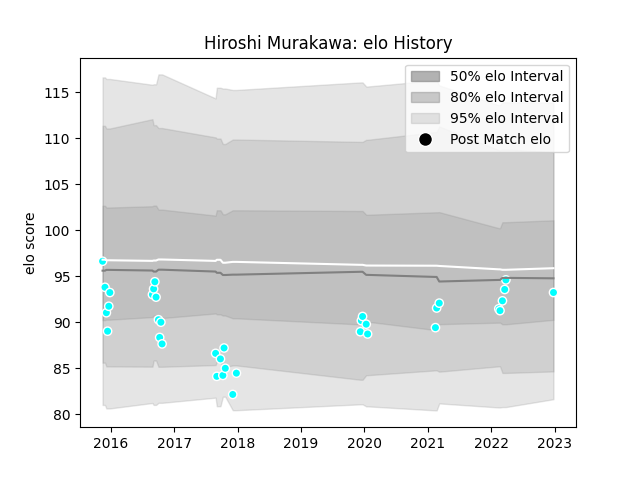

---  
layout: page  
title: Hiroshi Murakawa  
date: 2022-12-28 12:57:45.603147  
categories: player  
---
# Hiroshi Murakawa

## Positions: H

## Current elo: 93.0

## Current Percentile: 49.0

# Elo History

# Match History

| Team                             |   Appearances |   Win Rate |
|:---------------------------------|--------------:|-----------:|
| Toyota Industries Shuttles Aichi |            36 |   0.527778 |

| Opponent                          |   Matches |   Win Rate |
|:----------------------------------|----------:|-----------:|
| Coca-Cola Red Sparks              |         4 |   0.75     |
| Kyuden Voltex                     |         4 |   1        |
| Yokohama Canon Eagles             |         3 |   0        |
| Green Rockets Tokatsu             |         3 |   0.333333 |
| Toyota Verblitz                   |         3 |   0        |
| Kurita Water Gush                 |         2 |   1        |
| Shimizu Blue Sharks               |         2 |   1        |
| Chugoku Red Regulions             |         2 |   1        |
| Kobelco Kobe Steelers             |         2 |   0        |
| Munakata Sanix Blues              |         2 |   0.5      |
| Kubota Spears Funabashi Tokyo-Bay |         1 |   0        |
| NTT Docomo Red Hurricanes Osaka   |         1 |   1        |
| Saitama Wild Knights              |         1 |   0        |
| Kamaishi Seawaves                 |         1 |   1        |
| Shizuoka Blue Revs                |         1 |   0        |
| Tokyo Sungoliath                  |         1 |   0        |
| Toshiba Brave Lupus Tokyo         |         1 |   1        |
| Hino Red Dolphins                 |         1 |   1        |
| Urayasu D-Rocks                   |         1 |   0        |