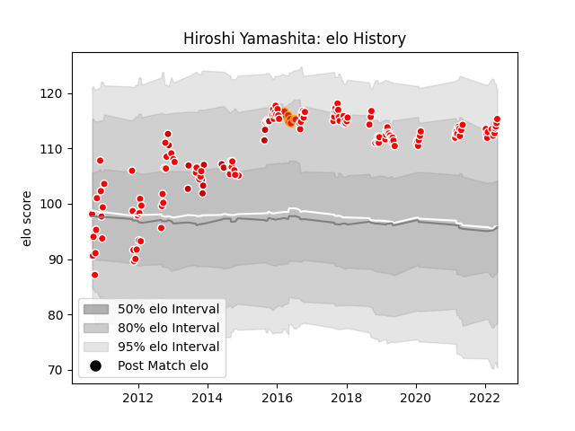

---  
layout: page  
title: Hiroshi Yamashita  
date: 2023-02-02 18:56:17.344363  
categories: player  
---
# Hiroshi Yamashita

## Positions: P

## Country: Japan

## Current elo: 125.0

## Current Percentile: 97.0

# Elo History

# Match History

| Team                  |   Appearances |   Win Rate |
|:----------------------|--------------:|-----------:|
| Kobelco Kobe Steelers |            90 |  0.677778  |
| Japan                 |            20 |  0.75      |
| Sunwolves             |            12 |  0.0833333 |
| Chiefs                |             9 |  0.555556  |

| Opponent                          |   Matches |   Win Rate |
|:----------------------------------|----------:|-----------:|
| Yokohama Canon Eagles             |        10 |  0.7       |
| Green Rockets Tokatsu             |         8 |  1         |
| Black Rams Tokyo                  |         8 |  0.875     |
| Toyota Verblitz                   |         7 |  0.428571  |
| Shizuoka Blue Revs                |         7 |  0.928571  |
| Tokyo Sungoliath                  |         6 |  0.333333  |
| Saitama Wild Knights              |         6 |  0.0833333 |
| Coca-Cola Red Sparks              |         5 |  1         |
| Urayasu D-Rocks                   |         5 |  0.6       |
| Hanazono Kintetsu Liners          |         5 |  0.6       |
| Toshiba Brave Lupus Tokyo         |         5 |  0.4       |
| NTT Docomo Red Hurricanes Osaka   |         5 |  0.8       |
| Kubota Spears Funabashi Tokyo-Bay |         4 |  0.5       |
| Highlanders                       |         3 |  0         |
| Toyota Industries Shuttles Aichi  |         3 |  1         |
| Melbourne Rebels                  |         3 |  0.333333  |
| Scotland                          |         2 |  0         |
| Samoa                             |         2 |  1         |
| New Zealand                       |         2 |  0         |
| Sharks                            |         2 |  0.5       |
| Romania                           |         2 |  1         |
| Uruguay                           |         2 |  1         |
| Wales                             |         2 |  0.5       |
| Russia                            |         2 |  1         |
| New South Wales Waratahs          |         2 |  0         |
| Queensland Reds                   |         2 |  0         |
| Munakata Sanix Blues              |         2 |  0.5       |
| Mie Honda Heat                    |         2 |  1         |
| Lions                             |         2 |  0         |
| Crusaders                         |         2 |  1         |
| Georgia                           |         2 |  1         |
| Hurricanes                        |         1 |  0         |
| Brumbies                          |         1 |  0         |
| United States of America          |         1 |  1         |
| Hino Red Dolphins                 |         1 |  1         |
| Jaguares                          |         1 |  1         |
| Italy                             |         1 |  1         |
| Blues                             |         1 |  0         |
| Spain                             |         1 |  1         |
| South Africa                      |         1 |  1         |
| Kyuden Voltex                     |         1 |  1         |
| Chiefs                            |         1 |  1         |