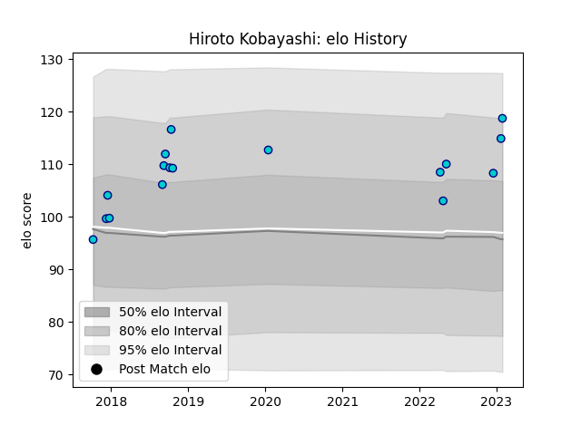

---  
layout: page  
title: Hiroto Kobayashi  
date: 2022-12-18 16:23:05.688228  
categories: player  
---
# Hiroto Kobayashi

## Positions: C

## Current elo: 102.0

## Current Percentile: 77.0

# Elo History

# Match History

| Team               |   Appearances |   Win Rate |
|:-------------------|--------------:|-----------:|
| Shizuoka Blue Revs |            14 |   0.714286 |

| Opponent                          |   Matches |   Win Rate |
|:----------------------------------|----------:|-----------:|
| Toyota Verblitz                   |         3 |   0.333333 |
| Black Rams Tokyo                  |         2 |   1        |
| Coca-Cola Red Sparks              |         2 |   1        |
| Toshiba Brave Lupus Tokyo         |         2 |   0.5      |
| Kubota Spears Funabashi Tokyo-Bay |         1 |   1        |
| Mie Honda Heat                    |         1 |   1        |
| Munakata Sanix Blues              |         1 |   1        |
| Saitama Wild Knights              |         1 |   0        |
| Yokohama Canon Eagles             |         1 |   1        |