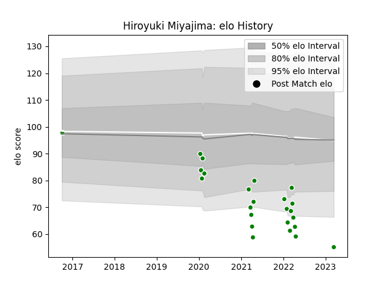

---  
layout: page  
title: Hiroyuki Miyajima  
date: 2023-03-21 18:41:32.100819  
categories: player  
---
# Hiroyuki Miyajima

Last updated: 2023-03-21
## Positions: W, FB

## Current elo: 55.0

## Current Percentile: 1.0

# Elo History

# Match History

| Team                  |   Appearances |   Win Rate |
|:----------------------|--------------:|-----------:|
| Green Rockets Tokatsu |            25 |       0.08 |

| Opponent                          |   Matches |   Win Rate |
|:----------------------------------|----------:|-----------:|
| Kobelco Kobe Steelers             |         3 |        0   |
| Yokohama Canon Eagles             |         3 |        0   |
| Black Rams Tokyo                  |         2 |        0   |
| Hino Red Dolphins                 |         2 |        0   |
| Kubota Spears Funabashi Tokyo-Bay |         2 |        0   |
| Shizuoka Blue Revs                |         2 |        0   |
| Tokyo Sungoliath                  |         2 |        0   |
| Toshiba Brave Lupus Tokyo         |         2 |        0   |
| Toyota Verblitz                   |         2 |        0.5 |
| Mitsubishi Dynaboars              |         1 |        0   |
| Munakata Sanix Blues              |         1 |        0   |
| NTT Docomo Red Hurricanes Osaka   |         1 |        0   |
| Saitama Wild Knights              |         1 |        0   |
| Toyota Industries Shuttles Aichi  |         1 |        1   |