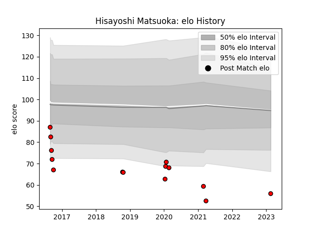

---  
layout: page  
title: Hisayoshi Matsuoka  
date: 2023-02-24 02:20:35.301568  
categories: player  
---
# Hisayoshi Matsuoka

## Positions: W

## Current elo: 56.0

## Current Percentile: None

# Elo History

# Match History

| Team                      |   Appearances |   Win Rate |
|:--------------------------|--------------:|-----------:|
| Toshiba Brave Lupus Tokyo |            14 |   0.428571 |

| Opponent                          |   Matches |   Win Rate |
|:----------------------------------|----------:|-----------:|
| Kubota Spears Funabashi Tokyo-Bay |         3 |   0.333333 |
| Mie Honda Heat                    |         2 |   0.5      |
| Yokohama Canon Eagles             |         2 |   0.5      |
| Green Rockets Tokatsu             |         1 |   1        |
| Kobelco Kobe Steelers             |         1 |   0        |
| Munakata Sanix Blues              |         1 |   0        |
| NTT Docomo Red Hurricanes Osaka   |         1 |   1        |
| Shizuoka Blue Revs                |         1 |   0        |
| Tokyo Sungoliath                  |         1 |   1        |
| Urayasu D-Rocks                   |         1 |   0        |