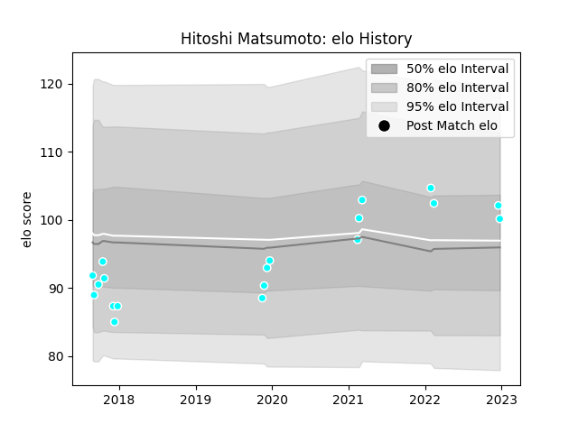

---  
layout: page  
title: Hitoshi Matsumoto  
date: 2023-03-02 11:20:35.770269  
categories: player  
---
# Hitoshi Matsumoto

## Positions: C

## Current elo: 107.0

## Current Percentile: 82.0

# Elo History

# Match History

| Team                             |   Appearances |   Win Rate |
|:---------------------------------|--------------:|-----------:|
| Toyota Industries Shuttles Aichi |            33 |   0.484848 |

| Opponent                          |   Matches |   Win Rate |
|:----------------------------------|----------:|-----------:|
| Coca-Cola Red Sparks              |         3 |   1        |
| Hanazono Kintetsu Liners          |         3 |   0.333333 |
| Kyuden Voltex                     |         3 |   1        |
| Munakata Sanix Blues              |         3 |   0.666667 |
| Yokohama Canon Eagles             |         2 |   0        |
| Shimizu Blue Sharks               |         2 |   1        |
| Green Rockets Tokatsu             |         2 |   0        |
| Urayasu D-Rocks                   |         2 |   0        |
| Chugoku Red Regulions             |         2 |   1        |
| Toyota Verblitz                   |         1 |   0        |
| Toshiba Brave Lupus Tokyo         |         1 |   0        |
| Tokyo Sungoliath                  |         1 |   0        |
| Shizuoka Blue Revs                |         1 |   0        |
| Black Rams Tokyo                  |         1 |   0        |
| NTT Docomo Red Hurricanes Osaka   |         1 |   0        |
| Kurita Water Gush                 |         1 |   1        |
| Kubota Spears Funabashi Tokyo-Bay |         1 |   0        |
| Kobelco Kobe Steelers             |         1 |   0        |
| Hino Red Dolphins                 |         1 |   1        |
| Mazda Blue Zoomers                |         1 |   1        |