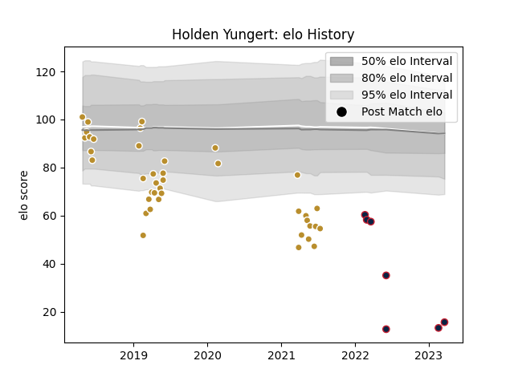

---  
layout: page  
title: Holden Yungert  
date: 2023-03-21 18:20:06.200807  
categories: player  
---
# Holden Yungert

Last updated: 2023-03-21
## Positions: SH

## Current elo: 16.0

## Current Percentile: 0.0

# Elo History

# Match History

| Team                   |   Appearances |   Win Rate |
|:-----------------------|--------------:|-----------:|
| NOLA Gold              |            40 |   0.5625   |
| New England Free Jacks |             7 |   0.571429 |

| Opponent               |   Matches |   Win Rate |
|:-----------------------|----------:|-----------:|
| Houston SaberCats      |         5 |   0.8      |
| Rugby New York         |         5 |   0.4      |
| Seattle Seawolves      |         5 |   0.2      |
| Old Glory DC           |         4 |   0.875    |
| R.U. New York          |         4 |   0.25     |
| San Diego Legion       |         4 |   0        |
| Toronto Arrows         |         4 |   1        |
| Utah Warriors          |         4 |   1        |
| Austin Elite Rugby     |         3 |   0.666667 |
| Glendale Raptors       |         3 |   0.333333 |
| Austin Gilgronis       |         2 |   0.5      |
| Colorado Raptors       |         1 |   1        |
| L. A. Giltinis         |         1 |   0        |
| NOLA Gold              |         1 |   1        |
| New England Free Jacks |         1 |   1        |