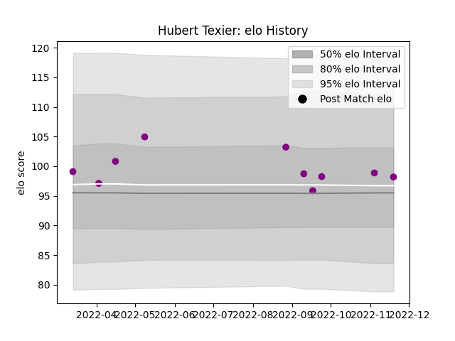

---  
layout: page  
title: Hubert Texier  
date: 2022-12-18 16:19:15.997986  
categories: player  
---
# Hubert Texier

## Positions: FL

## Current elo: 100.0

## Current Percentile: 70.0

# Elo History

# Match History

| Team             |   Appearances |   Win Rate |
|:-----------------|--------------:|-----------:|
| Soyaux-Angouleme |            14 |   0.571429 |

| Opponent           |   Matches |   Win Rate |
|:-------------------|----------:|-----------:|
| Agen               |         1 |          1 |
| Albi               |         1 |          1 |
| Aurillac           |         1 |          0 |
| Beziers            |         1 |          1 |
| Biarritz Olympique |         1 |          0 |
| Blagnac            |         1 |          1 |
| Bourgoin-Jallieu   |         1 |          1 |
| Grenoble           |         1 |          0 |
| Massy              |         1 |          1 |
| Montauban          |         1 |          0 |
| Oyonnax            |         1 |          0 |
| Provence Rugby     |         1 |          0 |
| Suresnes           |         1 |          1 |
| Vannes             |         1 |          1 |