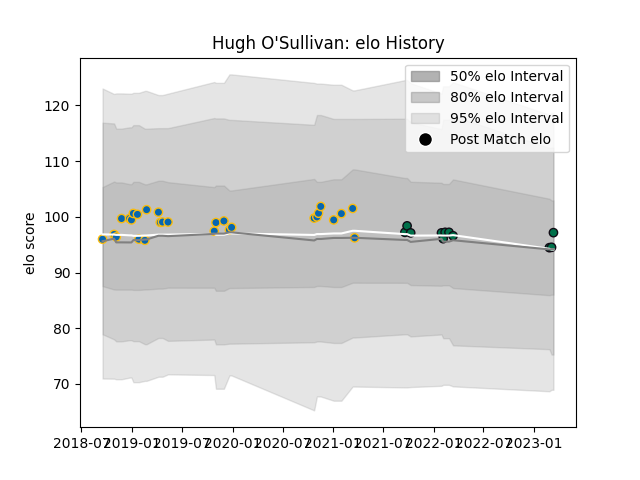

---  
layout: page  
title: Hugh O'Sullivan  
date: 2023-03-21 18:20:39.170762  
categories: player  
---
# Hugh O'Sullivan

Last updated: 2023-03-21
## Positions: SH

## Current elo: 97.0

## Current Percentile: None

# Elo History

# Match History

| Team         |   Appearances |   Win Rate |
|:-------------|--------------:|-----------:|
| Leinster     |            28 |   0.803571 |
| London Irish |            11 |   0.454545 |

| Opponent           |   Matches |   Win Rate |
|:-------------------|----------:|-----------:|
| Zebre              |         4 |   1        |
| Sale Sharks        |         3 |   0.666667 |
| Glasgow Warriors   |         3 |   0.666667 |
| Ospreys            |         3 |   0.666667 |
| Leicester Tigers   |         3 |   0        |
| Munster            |         2 |   0.5      |
| Ulster             |         2 |   1        |
| Southern Kings     |         2 |   1        |
| Scarlets           |         2 |   1        |
| Benetton Treviso   |         2 |   0.75     |
| Dragons            |         2 |   1        |
| Connacht           |         2 |   0.5      |
| Bristol Rugby      |         1 |   1        |
| Gloucester Rugby   |         1 |   0        |
| Exeter Chiefs      |         1 |   1        |
| Saracens           |         1 |   0        |
| Edinburgh          |         1 |   1        |
| Stade Toulousain   |         1 |   1        |
| Wasps              |         1 |   1        |
| Worcester Warriors |         1 |   0        |
| Newcastle Falcons  |         1 |   1        |