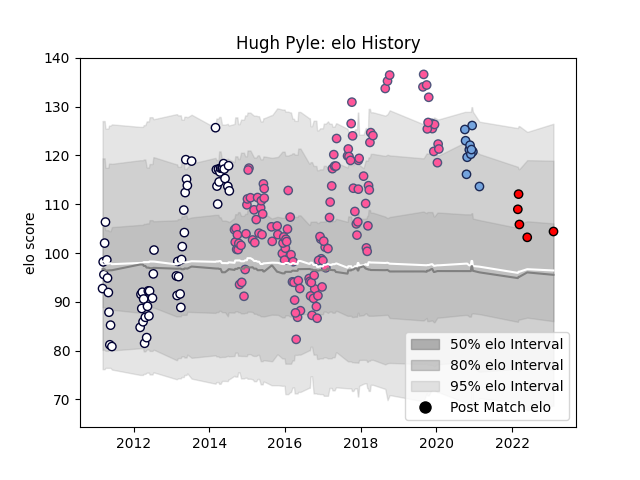

---  
layout: page  
title: Hugh Pyle  
date: 2023-02-09 13:55:31.873705  
categories: player  
---
# Hugh Pyle

## Positions: L

## Current elo: 105.0

## Current Percentile: 69.0

# Elo History

# Match History

| Team                      |   Appearances |   Win Rate |
|:--------------------------|--------------:|-----------:|
| Stade Francais Paris      |           126 |   0.492063 |
| Melbourne Rebels          |            59 |   0.254237 |
| Bayonne                   |            11 |   0.409091 |
| Toshiba Brave Lupus Tokyo |             5 |   0.4      |

| Opponent                          |   Matches |   Win Rate |
|:----------------------------------|----------:|-----------:|
| Toulon                            |        11 |   0.636364 |
| Clermont Auvergne                 |        11 |   0.409091 |
| Brive                             |        10 |   0.4      |
| Racing 92                         |         9 |   0.444444 |
| La Rochelle                       |         9 |   0.5      |
| Queensland Reds                   |         8 |   0.125    |
| Western Force                     |         7 |   0.857143 |
| Bordeaux Begles                   |         7 |   0.428571 |
| Stade Toulousain                  |         7 |   0.142857 |
| Montpellier Herault               |         7 |   0.571429 |
| New South Wales Waratahs          |         7 |   0.142857 |
| Castres Olympique                 |         6 |   0.833333 |
| Oyonnax                           |         6 |   0.333333 |
| Lyon                              |         6 |   0.166667 |
| Pau                               |         6 |   0.5      |
| Grenoble                          |         5 |   0.4      |
| Agen                              |         5 |   0.4      |
| Brumbies                          |         5 |   0.2      |
| Cheetahs                          |         4 |   0.25     |
| Highlanders                       |         4 |   0.25     |
| Sharks                            |         3 |   0        |
| Stormers                          |         3 |   0.333333 |
| Leicester Tigers                  |         3 |   0.333333 |
| Zebre                             |         3 |   0.5      |
| Crusaders                         |         3 |   0.333333 |
| Bayonne                           |         3 |   0.666667 |
| Hurricanes                        |         3 |   0.333333 |
| Blues                             |         3 |   0.333333 |
| Bulls                             |         3 |   0        |
| Chiefs                            |         3 |   0        |
| Edinburgh                         |         2 |   0.5      |
| Benetton Treviso                  |         2 |   1        |
| Bristol Rugby                     |         2 |   0        |
| Krasny Yar                        |         2 |   0.5      |
| Munster                           |         2 |   0.5      |
| Harlequins                        |         2 |   0.5      |
| Lions                             |         2 |   0        |
| London Irish                      |         2 |   0.5      |
| Stade Francais Paris              |         1 |   1        |
| Yokohama Canon Eagles             |         1 |   1        |
| Bath Rugby                        |         1 |   1        |
| Urayasu D-Rocks                   |         1 |   0        |
| Tokyo Sungoliath                  |         1 |   0        |
| Southern Kings                    |         1 |   0        |
| Newcastle Falcons                 |         1 |   1        |
| Bucuresti                         |         1 |   1        |
| Green Rockets Tokatsu             |         1 |   1        |
| Gloucester Rugby                  |         1 |   1        |
| Perpignan                         |         1 |   1        |
| Krasny Yar Krasnoyarsk            |         1 |   1        |
| Dragons                           |         1 |   0        |
| Ospreys                           |         1 |   1        |
| Kubota Spears Funabashi Tokyo-Bay |         1 |   0        |