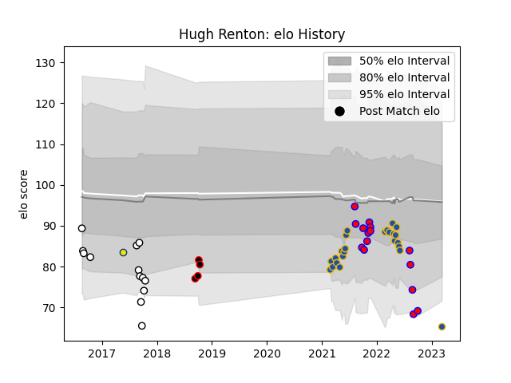

---  
layout: page  
title: Hugh Renton  
date: 2023-03-11 00:16:20.266936  
categories: player  
---
# Hugh Renton

## Positions: FL, N8

## Current elo: 69.0

## Current Percentile: 5.0

# Elo History

# Match History

| Team        |   Appearances |   Win Rate |
|:------------|--------------:|-----------:|
| Highlanders |            23 |   0.434783 |
| Tasman      |            15 |   0.466667 |
| Hawke's Bay |            13 |   0.153846 |
| Canterbury  |             4 |   1        |
| Hurricanes  |             1 |   1        |

| Opponent                 |   Matches |   Win Rate |
|:-------------------------|----------:|-----------:|
| Blues                    |         5 |   0        |
| Hawke's Bay              |         4 |   0.5      |
| Wellington               |         3 |   0.333333 |
| Canterbury               |         3 |   0        |
| Waikato                  |         3 |   0        |
| Taranaki                 |         3 |   0.333333 |
| Counties Manukau         |         3 |   0.333333 |
| Crusaders                |         3 |   0.333333 |
| Southland                |         3 |   1        |
| Manawatu                 |         2 |   1        |
| New South Wales Waratahs |         2 |   0.5      |
| Queensland Reds          |         2 |   1        |
| Otago                    |         2 |   0        |
| North Harbour            |         2 |   0.5      |
| Western Force            |         2 |   1        |
| Melbourne Rebels         |         2 |   0.5      |
| Bay of Plenty            |         2 |   0.5      |
| Hurricanes               |         2 |   0        |
| Chiefs                   |         2 |   0.5      |
| Brumbies                 |         2 |   0.5      |
| Northland                |         1 |   0        |
| Fijian Drua              |         1 |   1        |
| Cheetahs                 |         1 |   1        |
| Auckland                 |         1 |   1        |