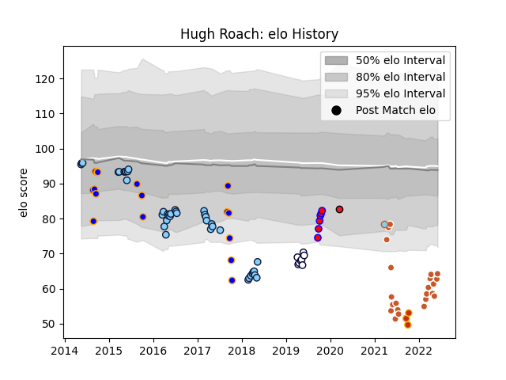

---  
layout: page  
title: Hugh Roach  
date: 2023-03-09 10:09:37.564527  
categories: player  
---
# Hugh Roach

## Positions: H

## Current elo: 64.0

## Current Percentile: 2.0

# Elo History

# Match History

| Team                     |   Appearances |   Win Rate |
|:-------------------------|--------------:|-----------:|
| New South Wales Waratahs |            41 |   0.573171 |
| Austin Gilgronis         |            22 |   0.681818 |
| Greater Sydney Rams      |            16 |   0.40625  |
| Melbourne Rebels         |             8 |   0.375    |
| Tasman                   |             6 |   1        |
| Perpignan                |             3 |   0        |
| Austin Herd              |             1 |   0        |
| Crusaders                |             1 |   1        |

| Opponent                 |   Matches |   Win Rate |
|:-------------------------|----------:|-----------:|
| Queensland Reds          |         5 |   1        |
| Sunwolves                |         5 |   1        |
| Brumbies                 |         4 |   0.5      |
| Blues                    |         4 |   0.25     |
| Lions                    |         4 |   0.25     |
| Seattle Seawolves        |         4 |   1        |
| L. A. Giltinis           |         4 |   0.25     |
| NSW Country Eagles       |         3 |   0.333333 |
| Melbourne Rebels         |         3 |   0.666667 |
| Perth Spirit             |         3 |   0.333333 |
| Western Force            |         3 |   0.666667 |
| San Diego Legion         |         3 |   1        |
| Crusaders                |         3 |   0.333333 |
| Sharks                   |         3 |   0.5      |
| Stormers                 |         3 |   0.666667 |
| Queensland Country       |         2 |   0        |
| Old Glory DC             |         2 |   0.5      |
| North Harbour Rays       |         2 |   0.75     |
| Utah Warriors            |         2 |   0        |
| New England Free Jacks   |         2 |   0        |
| Auckland                 |         2 |   1        |
| NOLA Gold                |         2 |   1        |
| Houston SaberCats        |         2 |   1        |
| Bulls                    |         2 |   0.5      |
| Cheetahs                 |         2 |   1        |
| Chiefs                   |         2 |   1        |
| New South Wales Waratahs |         2 |   0        |
| Hurricanes               |         2 |   0        |
| Pau                      |         1 |   0        |
| Southern Kings           |         1 |   0        |
| Wellington               |         1 |   1        |
| Waikato                  |         1 |   1        |
| Brisbane City            |         1 |   1        |
| Sydney Stars             |         1 |   1        |
| Sydney Rays              |         1 |   1        |
| Lyon                     |         1 |   0        |
| Canberra Vikings         |         1 |   0        |
| Jaguares                 |         1 |   0        |
| Northland                |         1 |   1        |
| Fijian Drua              |         1 |   0        |
| Melbourne Rising         |         1 |   0        |
| Racing 92                |         1 |   0        |
| R.U. New York            |         1 |   1        |
| Hawke's Bay              |         1 |   1        |
| Highlanders              |         1 |   0        |
| Rugby New York           |         1 |   1        |