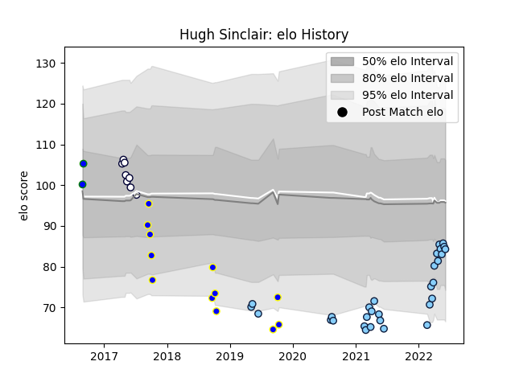

---  
layout: page  
title: Hugh Sinclair  
date: 2023-02-24 09:46:37.241221  
categories: player  
---
# Hugh Sinclair

## Positions: N8, L

## Current elo: 84.0

## Current Percentile: 24.0

# Elo History

# Match History

| Team                     |   Appearances |   Win Rate |
|:-------------------------|--------------:|-----------:|
| New South Wales Waratahs |            30 |  0.333333  |
| Sydney Rays              |            12 |  0.0833333 |
| Melbourne Rebels         |             8 |  0.1875    |
| North Harbour Rays       |             2 |  1         |

| Opponent            |   Matches |   Win Rate |
|:--------------------|----------:|-----------:|
| Western Force       |         7 |   0.428571 |
| Brumbies            |         6 |   0.166667 |
| Queensland Reds     |         5 |   0.2      |
| Chiefs              |         3 |   0        |
| Fijian Drua         |         3 |   0.666667 |
| Brisbane City       |         2 |   0        |
| Queensland Country  |         2 |   0        |
| NSW Country Eagles  |         2 |   0        |
| Melbourne Rising    |         2 |   0.5      |
| Melbourne Rebels    |         2 |   0.5      |
| Blues               |         2 |   0        |
| Hurricanes          |         2 |   0        |
| Highlanders         |         2 |   0.5      |
| Greater Sydney Rams |         2 |   0.5      |
| Crusaders           |         2 |   0.5      |
| Lions               |         2 |   0        |
| Moana Pasifika      |         1 |   1        |
| Perth Spirit        |         1 |   1        |
| Canberra Vikings    |         1 |   0        |
| Bulls               |         1 |   0        |
| Sharks              |         1 |   0.5      |
| Southern Kings      |         1 |   0        |