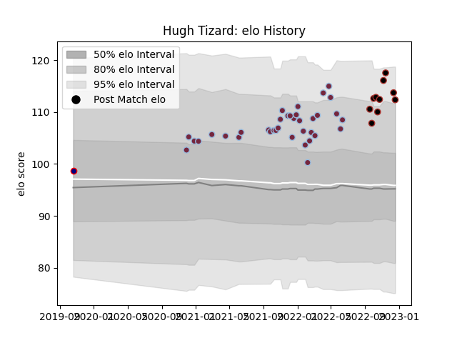

---  
layout: page  
title: Hugh Tizard  
date: 2022-11-16 11:21:11.585390  
categories: player  
---
# Hugh Tizard

## Positions: L

## Current elo: 116.0

## Current Percentile: 92.0

# Elo History

# Match History

| Team            |   Appearances |   Win Rate |
|:----------------|--------------:|-----------:|
| Harlequins      |            36 |      0.625 |
| Saracens        |             8 |      1     |
| London Scottish |             1 |      0     |

| Opponent           |   Matches |   Win Rate |
|:-------------------|----------:|-----------:|
| Newcastle Falcons  |         5 |   0.8      |
| Bristol Rugby      |         4 |   0.75     |
| Gloucester Rugby   |         4 |   1        |
| Northampton Saints |         4 |   0.75     |
| Bath Rugby         |         3 |   0.666667 |
| Exeter Chiefs      |         3 |   0.666667 |
| Leicester Tigers   |         3 |   0.666667 |
| London Irish       |         3 |   0.5      |
| Sale Sharks        |         3 |   0        |
| Saracens           |         3 |   0        |
| Worcester Warriors |         3 |   1        |
| Castres Olympique  |         2 |   1        |
| Wasps              |         2 |   1        |
| Cardiff Blues      |         1 |   1        |
| Harlequins         |         1 |   1        |
| Nottingham         |         1 |   0        |