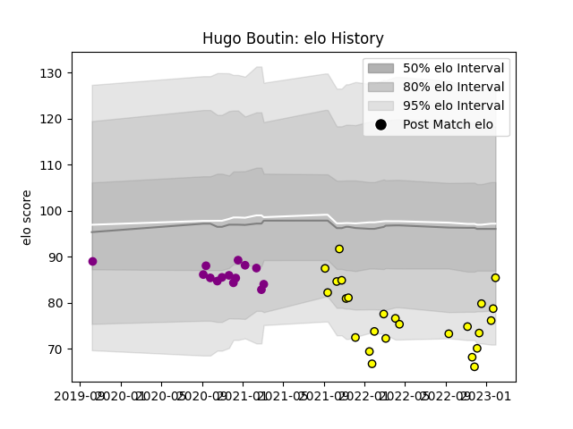

---  
layout: page  
title: Hugo Boutin  
date: 2022-11-22 11:44:54.972823  
categories: player  
---
# Hugo Boutin

## Positions: FL

## Current elo: 79.0

## Current Percentile: 6.0

# Elo History

# Match History

| Team             |   Appearances |   Win Rate |
|:-----------------|--------------:|-----------:|
| Albi             |            15 |        0.6 |
| Soyaux-Angouleme |             5 |        0   |

| Opponent                   |   Matches |   Win Rate |
|:---------------------------|----------:|-----------:|
| Chambery                   |         2 |        1   |
| Massy                      |         2 |        0.5 |
| Suresnes                   |         2 |        1   |
| Valence Romans Drome Rugby |         2 |        0.5 |
| Vannes                     |         2 |        0   |
| Aubenas                    |         1 |        1   |
| Cognac Saint Jean d'Angély |         1 |        1   |
| Dax                        |         1 |        0   |
| Nevers                     |         1 |        0   |
| Nice                       |         1 |        0   |
| Perpignan                  |         1 |        0   |
| Provence Rugby             |         1 |        0   |
| Rennes                     |         1 |        1   |
| Soyaux-Angouleme           |         1 |        0   |
| Tarbes                     |         1 |        0   |