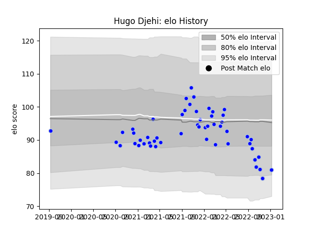

---  
layout: page  
title: Hugo Djehi  
date: 2022-11-22 11:41:30.985175  
categories: player  
---
# Hugo Djehi

## Positions: P

## Current elo: 95.0

## Current Percentile: 55.0

# Elo History

# Match History

| Team      |   Appearances |   Win Rate |
|:----------|--------------:|-----------:|
| Colomiers |            29 |    0.62069 |

| Opponent         |   Matches |   Win Rate |
|:-----------------|----------:|-----------:|
| Montauban        |         4 |   0.5      |
| Provence Rugby   |         4 |   0.75     |
| Beziers          |         3 |   0.666667 |
| Oyonnax          |         3 |   1        |
| Agen             |         2 |   1        |
| Carcassonne      |         2 |   0.5      |
| US Bressane      |         2 |   0.5      |
| Vannes           |         2 |   0        |
| Aurillac         |         1 |   0        |
| Bayonne          |         1 |   0        |
| Mont-de-Marsan   |         1 |   0        |
| Narbonne         |         1 |   1        |
| Nevers           |         1 |   1        |
| Rouen            |         1 |   1        |
| Soyaux-Angouleme |         1 |   1        |