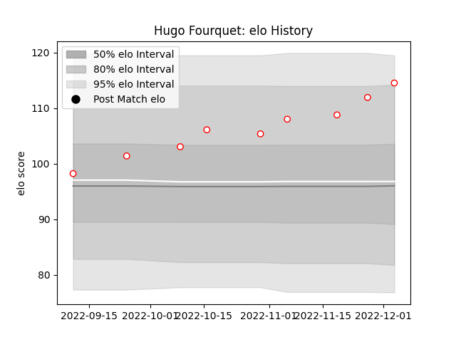

---  
layout: page  
title: Hugo Fourquet  
date: 2023-01-17 11:33:55.798917  
categories: player  
---
# Hugo Fourquet

## Positions: C

## Current elo: 114.0

## Current Percentile: 89.0

# Elo History

# Match History

| Team    |   Appearances |   Win Rate |
|:--------|--------------:|-----------:|
| Dax     |            10 |        0.8 |
| Bayonne |             1 |        1   |

| Opponent                   |   Matches |   Win Rate |
|:---------------------------|----------:|-----------:|
| Nice                       |         2 |          1 |
| Albi                       |         1 |          0 |
| Bourgoin-Jallieu           |         1 |          0 |
| Carqueiranne-Hyères        |         1 |          1 |
| Cognac Saint Jean d'Angély |         1 |          1 |
| Oyonnax                    |         1 |          1 |
| Rennes                     |         1 |          1 |
| Suresnes                   |         1 |          1 |
| Tarbes                     |         1 |          1 |
| Valence Romans Drome Rugby |         1 |          1 |