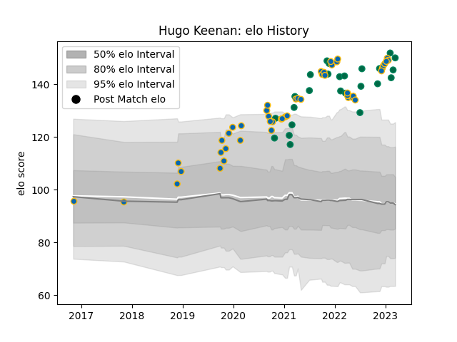

---  
layout: page  
title: Hugo Keenan  
date: 2023-03-17 17:21:44.332292  
categories: player  
---
# Hugo Keenan

## Positions: FB, W

## Country: Ireland

## Current elo: 150.0

## Current Percentile: 99.0

# Elo History

# Match History

| Team     |   Appearances |   Win Rate |
|:---------|--------------:|-----------:|
| Leinster |            49 |   0.918367 |
| Ireland  |            25 |   0.8      |

| Opponent                 |   Matches |   Win Rate |
|:-------------------------|----------:|-----------:|
| Munster                  |         7 |   1        |
| Connacht                 |         5 |   1        |
| Ospreys                  |         4 |   1        |
| New Zealand              |         4 |   0.75     |
| Ulster                   |         4 |   1        |
| France                   |         4 |   0.25     |
| Glasgow Warriors         |         4 |   0.75     |
| Scotland                 |         3 |   1        |
| Wales                    |         3 |   0.666667 |
| Dragons                  |         3 |   1        |
| Italy                    |         3 |   1        |
| La Rochelle              |         2 |   0        |
| Racing 92                |         2 |   1        |
| Montpellier Herault      |         2 |   1        |
| Zebre                    |         2 |   1        |
| Japan                    |         2 |   1        |
| England                  |         2 |   1        |
| Benetton Treviso         |         2 |   1        |
| Bath Rugby               |         2 |   1        |
| Gloucester Rugby         |         2 |   1        |
| Stade Toulousain         |         1 |   1        |
| Scarlets                 |         1 |   1        |
| United States of America |         1 |   1        |
| South Africa             |         1 |   1        |
| Argentina                |         1 |   1        |
| Saracens                 |         1 |   0        |
| Northampton Saints       |         1 |   1        |
| Australia                |         1 |   1        |
| Exeter Chiefs            |         1 |   1        |
| Edinburgh                |         1 |   1        |
| Bulls                    |         1 |   1        |
| Leicester Tigers         |         1 |   1        |