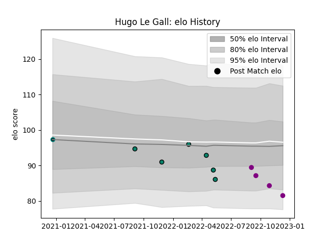

---  
layout: page  
title: Hugo Le Gall  
date: 2022-12-14 11:27:11.993751  
categories: player  
---
# Hugo Le Gall

## Positions: W

## Current elo: 82.0

## Current Percentile: 11.0

# Elo History

# Match History

| Team             |   Appearances |   Win Rate |
|:-----------------|--------------:|-----------:|
| Montauban        |             6 |   0.333333 |
| Soyaux-Angouleme |             4 |   0        |
| Pau              |             1 |   0        |

| Opponent           |   Matches |   Win Rate |
|:-------------------|----------:|-----------:|
| Nevers             |         2 |          0 |
| Provence Rugby     |         2 |          0 |
| Bayonne            |         1 |          0 |
| Biarritz Olympique |         1 |          0 |
| Carcassonne        |         1 |          1 |
| Colomiers          |         1 |          0 |
| London Irish       |         1 |          0 |
| Narbonne           |         1 |          1 |
| Vannes             |         1 |          0 |