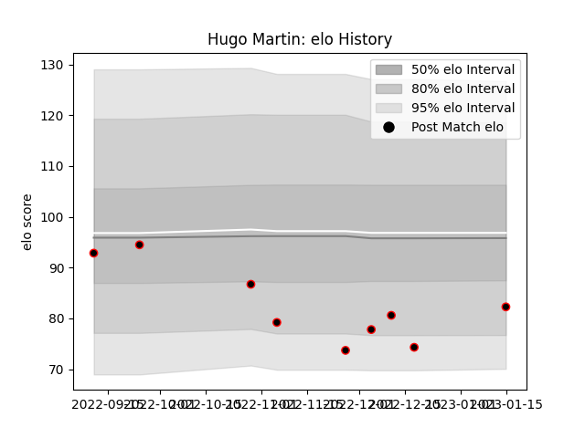

---  
layout: page  
title: Hugo Martin  
date: 2023-03-17 17:03:15.165348  
categories: player  
---
# Hugo Martin

## Positions: W

## Current elo: 73.0

## Current Percentile: 3.0

# Elo History

# Match History

| Team   |   Appearances |   Win Rate |
|:-------|--------------:|-----------:|
| Nice   |            11 |        0.5 |

| Opponent            |   Matches |   Win Rate |
|:--------------------|----------:|-----------:|
| Dax                 |         2 |        0   |
| US Bressane         |         2 |        0.5 |
| Albi                |         1 |        0.5 |
| Blagnac             |         1 |        1   |
| Carqueiranne-Hyères |         1 |        1   |
| Chambery            |         1 |        0   |
| Narbonne            |         1 |        0   |
| Rennes              |         1 |        1   |
| Suresnes            |         1 |        1   |