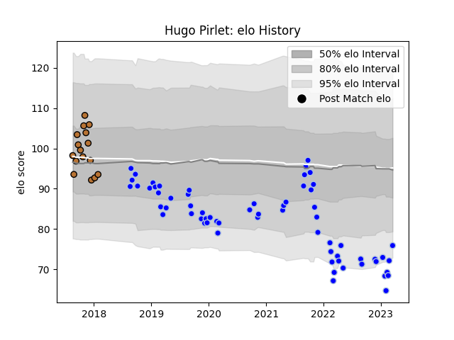

---  
layout: page  
title: Hugo Pirlet  
date: 2023-02-02 18:45:10.093794  
categories: player  
---
# Hugo Pirlet

## Positions: P

## Current elo: 81.0

## Current Percentile: 10.0

# Elo History

# Match History

| Team      |   Appearances |   Win Rate |
|:----------|--------------:|-----------:|
| Colomiers |            59 |    0.59322 |
| Narbonne  |            16 |    0.34375 |

| Opponent           |   Matches |   Win Rate |
|:-------------------|----------:|-----------:|
| Aurillac           |         9 |   0.333333 |
| Montauban          |         6 |   0.666667 |
| Nevers             |         5 |   0.4      |
| Carcassonne        |         5 |   0.4      |
| Grenoble           |         5 |   0.8      |
| Mont-de-Marsan     |         5 |   0.6      |
| Vannes             |         4 |   0.25     |
| Soyaux-Angouleme   |         4 |   0.5      |
| Provence Rugby     |         4 |   0.75     |
| Oyonnax            |         4 |   0.5      |
| Biarritz Olympique |         4 |   0.75     |
| Rouen              |         3 |   0.666667 |
| Beziers            |         3 |   0.666667 |
| Bayonne            |         3 |   0.333333 |
| Perpignan          |         2 |   0        |
| Massy              |         2 |   1        |
| Brive              |         2 |   0.5      |
| US Bressane        |         2 |   0.5      |
| Narbonne           |         2 |   1        |
| Colomiers          |         1 |   0.5      |