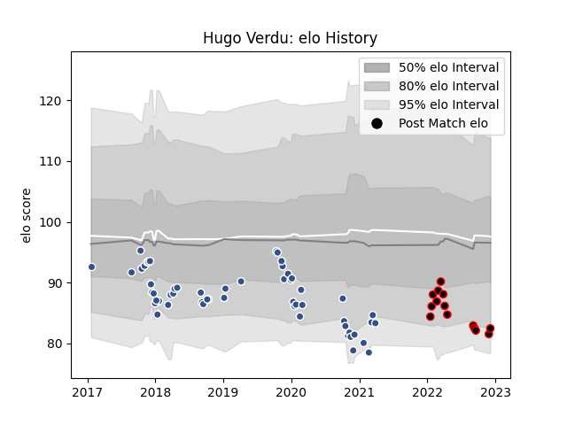

---  
layout: page  
title: Hugo Verdu  
date: 2022-12-09 13:05:58.261455  
categories: player  
---
# Hugo Verdu

## Positions: FH, SH

## Current elo: 82.0

## Current Percentile: 8.0

# Elo History

# Match History

| Team   |   Appearances |   Win Rate |
|:-------|--------------:|-----------:|
| Agen   |            55 |   0.245455 |
| Nice   |            14 |   0.642857 |

| Opponent                   |   Matches |   Win Rate |
|:---------------------------|----------:|-----------:|
| Bordeaux Begles            |         5 |   0.2      |
| Brive                      |         5 |   0.4      |
| Stade Toulousain           |         4 |   0        |
| Stade Francais Paris       |         4 |   0.5      |
| Clermont Auvergne          |         4 |   0.25     |
| Montpellier Herault        |         4 |   0        |
| Toulon                     |         3 |   0.333333 |
| Pau                        |         3 |   0.333333 |
| La Rochelle                |         2 |   0        |
| Gloucester Rugby           |         2 |   0        |
| Wasps                      |         2 |   0        |
| Racing 92                  |         2 |   0.25     |
| Lyon                       |         2 |   0        |
| Zebre                      |         2 |   0.5      |
| Edinburgh                  |         2 |   0        |
| Bayonne                    |         2 |   0.5      |
| Dax                        |         2 |   0.5      |
| Blagnac                    |         2 |   1        |
| Castres Olympique          |         2 |   0.5      |
| Bourgoin-Jallieu           |         2 |   0        |
| Rennes                     |         1 |   1        |
| Benetton Treviso           |         1 |   0        |
| Tarbes                     |         1 |   1        |
| Biarritz Olympique         |         1 |   0        |
| Soyaux-Angouleme           |         1 |   1        |
| Perpignan                  |         1 |   1        |
| Harlequins                 |         1 |   0        |
| Oyonnax                    |         1 |   1        |
| Narbonne                   |         1 |   0        |
| Cognac Saint Jean d'Angély |         1 |   0        |
| Massy                      |         1 |   1        |
| Aubenas                    |         1 |   1        |
| Albi                       |         1 |   1        |