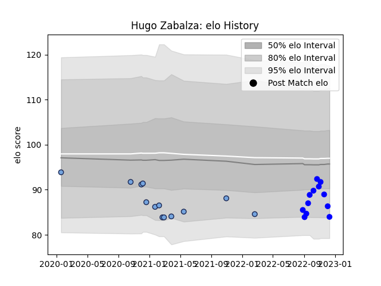

---  
layout: page  
title: Hugo Zabalza  
date: 2023-01-23 15:29:22.975104  
categories: player  
---
# Hugo Zabalza

## Positions: SH

## Current elo: 87.0

## Current Percentile: 23.0

# Elo History

# Match History

| Team            |   Appearances |   Win Rate |
|:----------------|--------------:|-----------:|
| Bayonne         |            24 |   0.604167 |
| Vannes          |            13 |   0.615385 |
| Bordeaux Begles |             1 |   0        |

| Opponent           |   Matches |   Win Rate |
|:-------------------|----------:|-----------:|
| Rouen              |         3 |   0.666667 |
| Beziers            |         2 |   0.5      |
| Toulon             |         2 |   0.5      |
| Stade Toulousain   |         2 |   0.5      |
| Colomiers          |         2 |   1        |
| Grenoble           |         2 |   1        |
| Racing 92          |         2 |   0.5      |
| Provence Rugby     |         2 |   1        |
| Aurillac           |         2 |   0.5      |
| Narbonne           |         2 |   1        |
| Agen               |         1 |   0        |
| Nevers             |         1 |   1        |
| Vannes             |         1 |   1        |
| US Bressane        |         1 |   1        |
| Soyaux-Angouleme   |         1 |   0        |
| Oyonnax            |         1 |   1        |
| Massy              |         1 |   1        |
| Mont-de-Marsan     |         1 |   0        |
| Lyon               |         1 |   0        |
| Leicester Tigers   |         1 |   0        |
| La Rochelle        |         1 |   0        |
| Gloucester Rugby   |         1 |   0        |
| Clermont Auvergne  |         1 |   0        |
| Castres Olympique  |         1 |   0        |
| Carcassonne        |         1 |   1        |
| Biarritz Olympique |         1 |   1        |
| Zebre              |         1 |   0.5      |