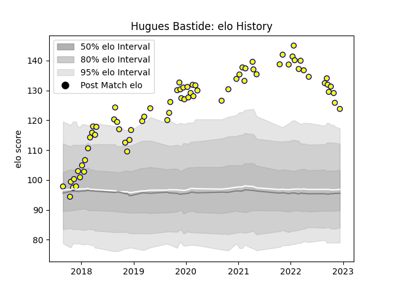

---  
layout: page  
title: Hugues Bastide  
date: 2022-12-14 11:11:27.029338  
categories: player  
---
# Hugues Bastide

## Positions: FL

## Current elo: 124.0

## Current Percentile: 97.0

# Elo History

# Match History

| Team   |   Appearances |   Win Rate |
|:-------|--------------:|-----------:|
| Nevers |            72 |   0.590278 |

| Opponent                   |   Matches |   Win Rate |
|:---------------------------|----------:|-----------:|
| Aurillac                   |         7 |   0.714286 |
| Mont-de-Marsan             |         6 |   0.833333 |
| Grenoble                   |         5 |   0.4      |
| Beziers                    |         5 |   0.6      |
| Biarritz Olympique         |         5 |   0.7      |
| Montauban                  |         5 |   0.2      |
| Carcassonne                |         5 |   0.4      |
| Narbonne                   |         4 |   1        |
| Vannes                     |         4 |   0.375    |
| Colomiers                  |         4 |   0.75     |
| Oyonnax                    |         3 |   0        |
| Rouen                      |         3 |   1        |
| Soyaux-Angouleme           |         3 |   0.5      |
| Massy                      |         2 |   1        |
| Perpignan                  |         2 |   1        |
| US Bressane                |         2 |   0.5      |
| Dax                        |         1 |   1        |
| Brive                      |         1 |   0        |
| Bayonne                    |         1 |   0        |
| Provence Rugby             |         1 |   1        |
| Roval Drome XV             |         1 |   1        |
| Valence Romans Drome Rugby |         1 |   0        |
| Agen                       |         1 |   0        |