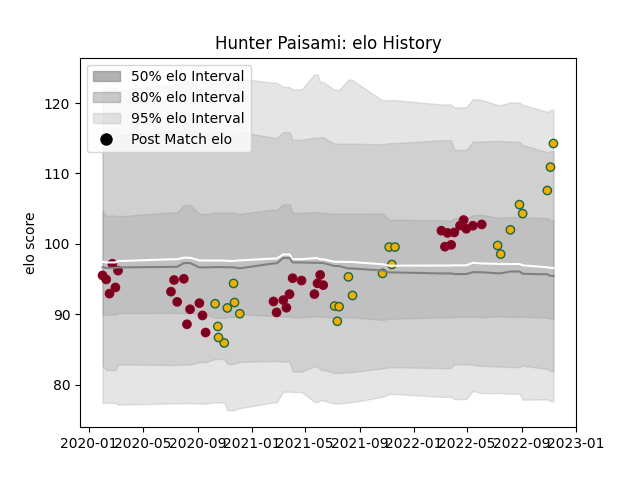

---  
layout: page  
title: Hunter Paisami  
date: 2023-03-17 17:27:47.141222  
categories: player  
---
# Hunter Paisami

## Positions: C

## Country: Australia

## Current elo: 115.0

## Current Percentile: 89.0

# Elo History

# Match History

| Team             |   Appearances |   Win Rate |
|:-----------------|--------------:|-----------:|
| Queensland Reds  |            39 |   0.5      |
| Australia        |            26 |   0.346154 |
| Brisbane City    |             8 |   0.4375   |
| Melbourne Rising |             7 |   0.142857 |

| Opponent                 |   Matches |   Win Rate |
|:-------------------------|----------:|-----------:|
| Brumbies                 |         8 |   0.375    |
| Western Force            |         7 |   0.571429 |
| New Zealand              |         7 |   0.214286 |
| Melbourne Rebels         |         6 |   0.916667 |
| New South Wales Waratahs |         5 |   0.8      |
| France                   |         4 |   0.5      |
| Argentina                |         4 |   0.625    |
| Fijian Drua              |         3 |   0.5      |
| England                  |         3 |   0        |
| Hurricanes               |         3 |   0        |
| Crusaders                |         3 |   0        |
| Sydney Rays              |         2 |   0.5      |
| South Africa             |         2 |   0.5      |
| Scotland                 |         2 |   0.5      |
| Queensland Country       |         2 |   0        |
| Canberra Vikings         |         2 |   0        |
| Chiefs                   |         2 |   0.5      |
| NSW Country Eagles       |         2 |   0.5      |
| Blues                    |         2 |   0        |
| Melbourne Rising         |         1 |   1        |
| Japan                    |         1 |   1        |
| Perth Spirit             |         1 |   0        |
| Jaguares                 |         1 |   0        |
| Italy                    |         1 |   0        |
| Sharks                   |         1 |   0        |
| Ireland                  |         1 |   0        |
| Sunwolves                |         1 |   1        |
| Greater Sydney Rams      |         1 |   1        |
| Wales                    |         1 |   0        |
| Lions                    |         1 |   0        |