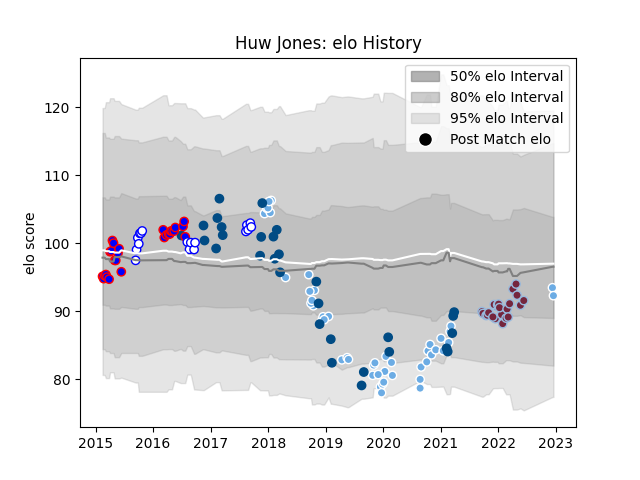

---  
layout: page  
title: Huw Jones  
date: 2023-01-13 11:34:19.240016  
categories: player  
---
# Huw Jones

## Positions: C, FB

## Country: Scotland

## Current elo: 83.0

## Current Percentile: 16.0

# Elo History

# Match History

| Team             |   Appearances |   Win Rate |
|:-----------------|--------------:|-----------:|
| Glasgow Warriors |            48 |   0.53125  |
| Scotland         |            30 |   0.533333 |
| Stormers         |            27 |   0.611111 |
| Harlequins       |            24 |   0.708333 |
| Western Province |            19 |   0.578947 |

| Opponent                 |   Matches |   Win Rate |
|:-------------------------|----------:|-----------:|
| Edinburgh                |        10 |   0.4      |
| Leinster                 |         7 |   0.142857 |
| Ireland                  |         5 |   0.2      |
| Blue Bulls               |         5 |   0.6      |
| Cheetahs                 |         4 |   0.75     |
| Italy                    |         4 |   1        |
| France                   |         4 |   0.5      |
| England                  |         4 |   0.5      |
| Saracens                 |         4 |   0        |
| Zebre                    |         4 |   1        |
| Wales                    |         4 |   0.25     |
| Cardiff Blues            |         4 |   1        |
| Pumas                    |         3 |   0.666667 |
| Southern Kings           |         3 |   0.666667 |
| Sharks                   |         3 |   0.333333 |
| Dragons                  |         3 |   0.666667 |
| Bulls                    |         3 |   0.666667 |
| Ulster                   |         3 |   0.333333 |
| Exeter Chiefs            |         3 |   0.833333 |
| Bath Rugby               |         3 |   0.666667 |
| Golden Lions             |         3 |   0.333333 |
| Natal Sharks             |         2 |   0.5      |
| London Irish             |         2 |   0.5      |
| Lyon                     |         2 |   1        |
| Worcester Warriors       |         2 |   1        |
| Sunwolves                |         2 |   0.75     |
| New South Wales Waratahs |         2 |   0.5      |
| Newcastle Falcons        |         2 |   1        |
| Northampton Saints       |         2 |   0.5      |
| Sale Sharks              |         2 |   0.5      |
| Western Force            |         2 |   1        |
| Lions                    |         2 |   0.5      |
| Argentina                |         2 |   1        |
| Leicester Tigers         |         2 |   0.5      |
| Griquas                  |         2 |   0.5      |
| Castres Olympique        |         2 |   1        |
| Chiefs                   |         2 |   0        |
| Eastern Province Kings   |         2 |   1        |
| Australia                |         2 |   0.5      |
| Gloucester Rugby         |         2 |   1        |
| Free State Cheetahs      |         2 |   0.5      |
| New Zealand              |         1 |   0        |
| Highlanders              |         1 |   0        |
| Benetton Treviso         |         1 |   1        |
| Blues                    |         1 |   1        |
| Wasps                    |         1 |   1        |
| Bristol Rugby            |         1 |   1        |
| Brumbies                 |         1 |   1        |
| Japan                    |         1 |   1        |
| Stormers                 |         1 |   1        |
| Jaguares                 |         1 |   1        |
| South Africa             |         1 |   0        |
| Connacht                 |         1 |   0        |
| Scarlets                 |         1 |   1        |
| Melbourne Rebels         |         1 |   1        |
| Samoa                    |         1 |   1        |
| Montpellier Herault      |         1 |   0        |
| Queensland Reds          |         1 |   1        |
| Georgia                  |         1 |   1        |
| Perpignan                |         1 |   1        |
| Ospreys                  |         1 |   0        |
| Hurricanes               |         1 |   0        |
| La Rochelle              |         1 |   0        |