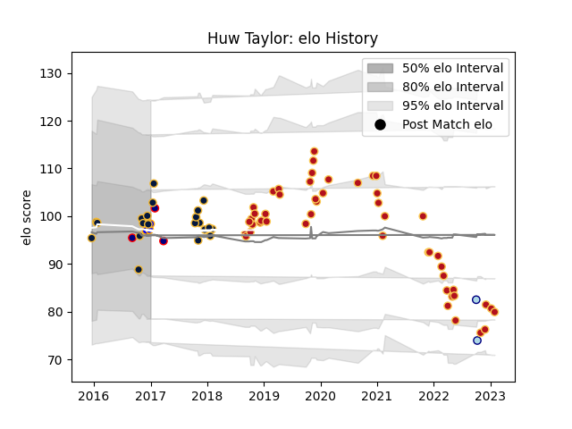

---  
layout: page  
title: Huw Taylor  
date: 2023-02-02 19:06:56.254222  
categories: player  
---
# Huw Taylor

## Positions: FL, L

## Current elo: 98.0

## Current Percentile: 61.0

# Elo History

# Match History

| Team               |   Appearances |   Win Rate |
|:-------------------|--------------:|-----------:|
| Dragons            |            49 |   0.204082 |
| Worcester Warriors |            21 |   0.261905 |
| Doncaster          |             3 |   0.666667 |
| London Scottish    |             3 |   0        |
| Bedford            |             2 |   0.5      |

| Opponent           |   Matches |   Win Rate |
|:-------------------|----------:|-----------:|
| Glasgow Warriors   |         6 |   0.333333 |
| Zebre              |         4 |   0.25     |
| Cardiff Blues      |         4 |   0        |
| Connacht           |         4 |   0.125    |
| RC Enisei          |         4 |   0.75     |
| Brive              |         4 |   0.25     |
| Dragons            |         3 |   0.333333 |
| Ulster             |         3 |   0        |
| Southern Kings     |         2 |   0.75     |
| Timisoara Saracens |         2 |   1        |
| Scarlets           |         2 |   0        |
| Leinster           |         2 |   0        |
| Oyonnax            |         2 |   0.5      |
| Ospreys            |         2 |   0        |
| Northampton Saints |         2 |   0        |
| Munster            |         2 |   0        |
| Benetton Treviso   |         2 |   0.25     |
| Lions              |         2 |   0        |
| Harlequins         |         2 |   0        |
| Edinburgh          |         2 |   0        |
| Clermont Auvergne  |         2 |   0        |
| Bulls              |         2 |   0        |
| La Rochelle        |         1 |   0        |
| Sharks             |         1 |   0        |
| Yorkshire Carnegie |         1 |   0        |
| Worcester Warriors |         1 |   0        |
| Wasps              |         1 |   0        |
| Bristol Rugby      |         1 |   1        |
| Stormers           |         1 |   0        |
| Caldy              |         1 |   1        |
| Sale Sharks        |         1 |   0        |
| Castres Olympique  |         1 |   1        |
| Jersey             |         1 |   0        |
| Rotherham Titans   |         1 |   1        |
| Richmond           |         1 |   1        |
| Cheetahs           |         1 |   0        |
| Doncaster          |         1 |   0        |
| Nottingham         |         1 |   0        |
| Gloucester Rugby   |         1 |   0        |
| Bedford            |         1 |   0        |