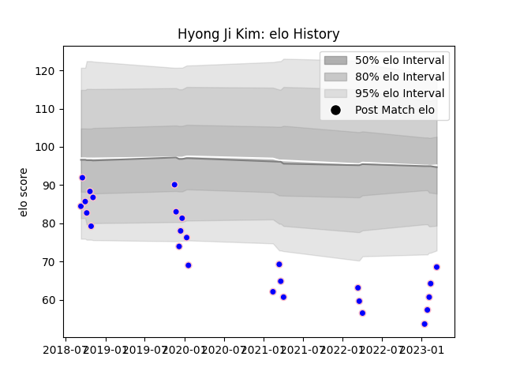

---  
layout: page  
title: Hyong Ji Kim  
date: 2023-02-02 18:42:05.145830  
categories: player  
---
# Hyong Ji Kim

## Positions: P

## Current elo: 70.0

## Current Percentile: 4.0

# Elo History

# Match History

| Team              |   Appearances |   Win Rate |
|:------------------|--------------:|-----------:|
| Kurita Water Gush |            19 |   0.421053 |

| Opponent                         |   Matches |   Win Rate |
|:---------------------------------|----------:|-----------:|
| Chugoku Red Regulions            |         3 |   0.333333 |
| Hanazono Kintetsu Liners         |         2 |   0        |
| Kamaishi Seawaves                |         2 |   0.5      |
| Kyuden Voltex                    |         2 |   1        |
| Mazda Blue Zoomers               |         2 |   1        |
| NTT Docomo Red Hurricanes Osaka  |         2 |   0.5      |
| Toyota Industries Shuttles Aichi |         2 |   0        |
| Coca-Cola Red Sparks             |         1 |   0        |
| Mitsubishi Dynaboars             |         1 |   0        |
| Munakata Sanix Blues             |         1 |   0        |
| Shimizu Blue Sharks              |         1 |   1        |