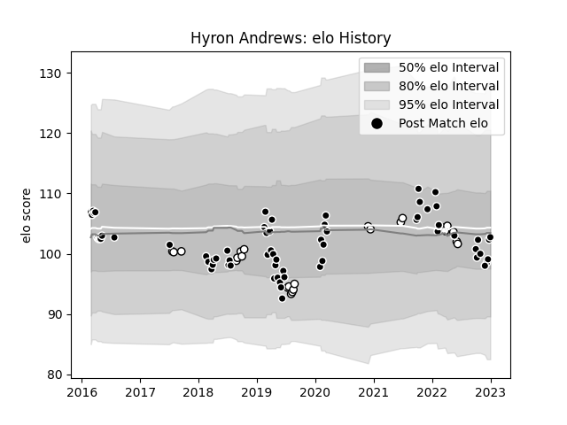

---  
layout: page  
title: Hyron Andrews  
date: 2023-01-06 00:15:01.983946  
categories: player  
---
# Hyron Andrews

## Positions: L

## Current elo: 103.0

## Current Percentile: 44.0

# Elo History

# Match History

| Team         |   Appearances |   Win Rate |
|:-------------|--------------:|-----------:|
| Sharks       |            65 |   0.523077 |
| Natal Sharks |            24 |   0.583333 |

| Opponent                 |   Matches |   Win Rate |
|:-------------------------|----------:|-----------:|
| Bulls                    |         9 |   0.5      |
| Stormers                 |         8 |   0.5625   |
| Lions                    |         7 |   0.714286 |
| Hurricanes               |         5 |   0.2      |
| Free State Cheetahs      |         5 |   0.4      |
| Jaguares                 |         5 |   0.6      |
| Griquas                  |         5 |   0.8      |
| Blue Bulls               |         4 |   0.75     |
| Western Province         |         4 |   0.25     |
| Blues                    |         3 |   0.666667 |
| Pumas                    |         3 |   0.666667 |
| Crusaders                |         3 |   0.166667 |
| Melbourne Rebels         |         3 |   0.666667 |
| Golden Lions             |         3 |   0.666667 |
| New South Wales Waratahs |         2 |   0.75     |
| Queensland Reds          |         2 |   0.5      |
| Chiefs                   |         2 |   0        |
| Cardiff Blues            |         2 |   0        |
| Highlanders              |         2 |   1        |
| Glasgow Warriors         |         2 |   0.5      |
| Ulster                   |         1 |   0        |
| Sunwolves                |         1 |   1        |
| Bordeaux Begles          |         1 |   1        |
| Southern Kings           |         1 |   1        |
| Harlequins               |         1 |   1        |
| Ospreys                  |         1 |   1        |
| Munster                  |         1 |   0        |
| Brumbies                 |         1 |   0        |
| Leinster                 |         1 |   0        |
| Dragons                  |         1 |   1        |