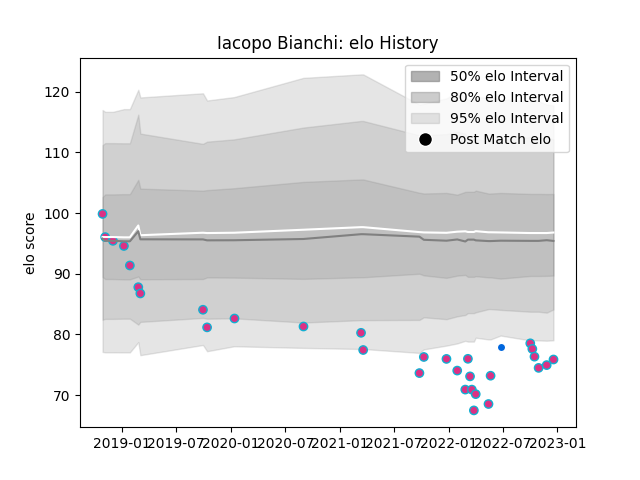

---  
layout: page  
title: Iacopo Bianchi  
date: 2023-01-06 00:22:14.310089  
categories: player  
---
# Iacopo Bianchi

## Positions: FL

## Country: Italy

## Current elo: 81.0

## Current Percentile: 3.0

# Elo History

# Match History

| Team   |   Appearances |   Win Rate |
|:-------|--------------:|-----------:|
| Zebre  |            32 |     0.0625 |
| Italy  |             1 |     1      |

| Opponent             |   Matches |   Win Rate |
|:---------------------|----------:|-----------:|
| Benetton Treviso     |         4 |        0   |
| Scarlets             |         3 |        0   |
| Ulster               |         3 |        0   |
| Cheetahs             |         2 |        0   |
| Edinburgh            |         2 |        0.5 |
| Glasgow Warriors     |         2 |        0   |
| Munster              |         2 |        0   |
| Ospreys              |         2 |        0   |
| Stormers             |         2 |        0   |
| Leinster             |         2 |        0   |
| Cardiff Blues        |         1 |        0   |
| Connacht             |         1 |        0   |
| Dragons              |         1 |        0   |
| Bristol Rugby        |         1 |        0   |
| Lions                |         1 |        0   |
| Namibia              |         1 |        1   |
| Bulls                |         1 |        0   |
| Sharks               |         1 |        0   |
| Stade Francais Paris |         1 |        1   |