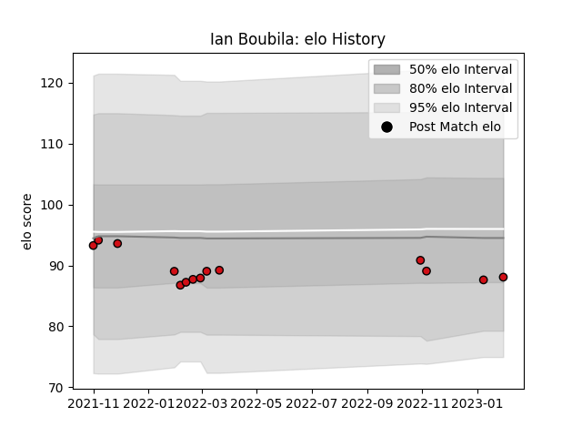

---  
layout: page  
title: Ian Boubila  
date: 2023-01-13 11:26:54.440838  
categories: player  
---
# Ian Boubila

## Positions: H

## Current elo: 88.0

## Current Percentile: 31.0

# Elo History

# Match History

| Team             |   Appearances |   Win Rate |
|:-----------------|--------------:|-----------:|
| Stade Toulousain |            13 |   0.346154 |

| Opponent             |   Matches |   Win Rate |
|:---------------------|----------:|-----------:|
| Stade Francais Paris |         3 |   0.166667 |
| Perpignan            |         2 |   0.5      |
| Racing 92            |         2 |   0        |
| Bayonne              |         1 |   0        |
| Bordeaux Begles      |         1 |   1        |
| Brive                |         1 |   1        |
| La Rochelle          |         1 |   0        |
| Montpellier Herault  |         1 |   1        |
| Pau                  |         1 |   0        |