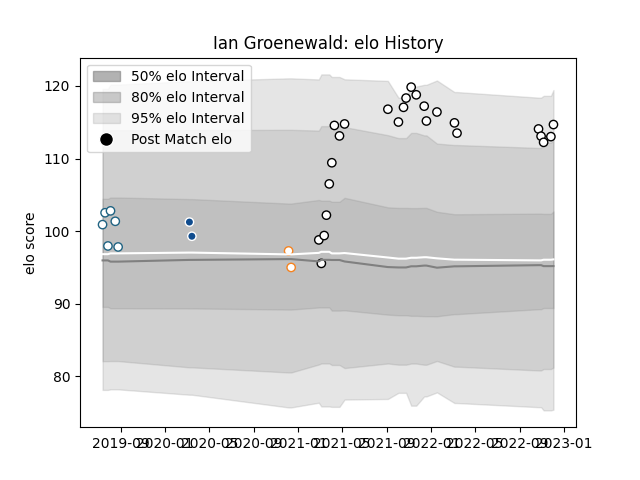

---  
layout: page  
title: Ian Groenewald  
date: 2023-01-23 15:33:27.226279  
categories: player  
---
# Ian Groenewald

## Positions: L

## Current elo: 103.0

## Current Percentile: 73.0

# Elo History

# Match History

| Team                       |   Appearances |   Win Rate |
|:---------------------------|--------------:|-----------:|
| Valence Romans Drome Rugby |            38 |   0.5      |
| Griquas                    |             6 |   0.666667 |
| Bulls                      |             2 |   0.5      |
| Free State Cheetahs        |             2 |   0        |

| Opponent                   |   Matches |   Win Rate |
|:---------------------------|----------:|-----------:|
| Albi                       |         3 |   0.333333 |
| Golden Lions               |         2 |   0        |
| Mont-de-Marsan             |         2 |   0.25     |
| Massy                      |         2 |   0        |
| Blagnac                    |         2 |   0.5      |
| Blue Bulls                 |         2 |   0.5      |
| Bourgoin-Jallieu           |         2 |   0.25     |
| Suresnes                   |         2 |   1        |
| Aubenas                    |         2 |   1        |
| Cognac Saint Jean d'Angély |         2 |   1        |
| Dax                        |         2 |   0.5      |
| Dijon                      |         2 |   0.5      |
| Perpignan                  |         1 |   0        |
| Pumas                      |         1 |   1        |
| Rennes                     |         1 |   1        |
| Queensland Reds            |         1 |   0        |
| Nice                       |         1 |   1        |
| Soyaux-Angouleme           |         1 |   0        |
| Tarbes                     |         1 |   1        |
| US Bressane                |         1 |   0        |
| Vannes                     |         1 |   1        |
| Oyonnax                    |         1 |   0        |
| Highlanders                |         1 |   1        |
| Nevers                     |         1 |   1        |
| Natal Sharks               |         1 |   1        |
| Montauban                  |         1 |   0        |
| Grenoble                   |         1 |   0        |
| Free State Cheetahs        |         1 |   0        |
| Colomiers                  |         1 |   0        |
| Chambery                   |         1 |   1        |
| Carcassonne                |         1 |   1        |
| Biarritz Olympique         |         1 |   0        |
| Beziers                    |         1 |   0        |
| Aurillac                   |         1 |   1        |
| Western Province           |         1 |   1        |