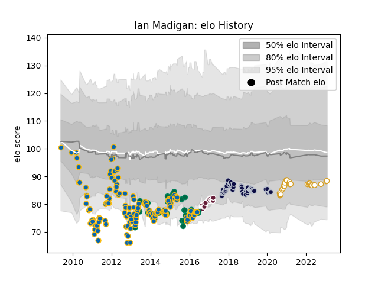

---  
layout: page  
title: Ian Madigan  
date: 2023-02-02 19:02:59.836734  
categories: player  
---
# Ian Madigan

## Positions: FH, C

## Country: Ireland

## Current elo: 88.0

## Current Percentile: 24.0

# Elo History

# Match History

| Team            |   Appearances |   Win Rate |
|:----------------|--------------:|-----------:|
| Leinster        |           164 |   0.728659 |
| Bristol Rugby   |            46 |   0.695652 |
| Ireland         |            34 |   0.676471 |
| Ulster          |            29 |   0.689655 |
| Bordeaux Begles |            22 |   0.477273 |
| Edinburgh       |             1 |   0        |

| Opponent                 |   Matches |   Win Rate |
|:-------------------------|----------:|-----------:|
| Ulster                   |        19 |   0.789474 |
| Glasgow Warriors         |        19 |   0.684211 |
| Munster                  |        16 |   0.5625   |
| Ospreys                  |        16 |   0.65625  |
| Connacht                 |        14 |   0.571429 |
| Cardiff Blues            |        13 |   0.923077 |
| Edinburgh                |        13 |   0.846154 |
| Dragons                  |        13 |   0.769231 |
| Scarlets                 |        12 |   0.916667 |
| Bath Rugby               |         8 |   0.75     |
| Benetton Treviso         |         8 |   0.875    |
| Clermont Auvergne        |         7 |   0.214286 |
| Zebre                    |         7 |   0.928571 |
| Castres Olympique        |         6 |   0.666667 |
| Wasps                    |         6 |   0.416667 |
| Northampton Saints       |         5 |   0.8      |
| Leinster                 |         5 |   0.2      |
| Harlequins               |         5 |   0.6      |
| France                   |         5 |   0.7      |
| South Africa             |         4 |   0.5      |
| Montpellier Herault      |         4 |   0.375    |
| Toulon                   |         4 |   0        |
| Italy                    |         4 |   0.75     |
| Aironi                   |         4 |   1        |
| Leicester Tigers         |         4 |   0.75     |
| Exeter Chiefs            |         4 |   0.75     |
| Argentina                |         3 |   0.666667 |
| Stade Francais Paris     |         3 |   0.666667 |
| Saracens                 |         3 |   0.666667 |
| Stade Toulousain         |         3 |   0.666667 |
| Wales                    |         3 |   0.5      |
| Scotland                 |         3 |   1        |
| England                  |         3 |   0.333333 |
| Jersey                   |         2 |   0.5      |
| Yorkshire Carnegie       |         2 |   1        |
| Worcester Warriors       |         2 |   0        |
| Sale Sharks              |         2 |   0.25     |
| Rotherham Titans         |         2 |   1        |
| Stormers                 |         2 |   0.5      |
| Richmond                 |         2 |   1        |
| Gloucester Rugby         |         2 |   0.5      |
| Bedford                  |         2 |   1        |
| La Rochelle              |         2 |   0        |
| Nottingham               |         2 |   1        |
| Canada                   |         2 |   1        |
| Cornish Pirates          |         2 |   1        |
| Doncaster                |         2 |   1        |
| Lyon                     |         2 |   0.5      |
| London Scottish          |         2 |   1        |
| Australia                |         2 |   0.5      |
| Bayonne                  |         2 |   0.5      |
| United States of America |         1 |   1        |
| Biarritz Olympique       |         1 |   1        |
| Georgia                  |         1 |   1        |
| Brive                    |         1 |   1        |
| Samoa                    |         1 |   1        |
| Romania                  |         1 |   1        |
| Pau                      |         1 |   1        |
| Bulls                    |         1 |   0        |
| Newcastle Falcons        |         1 |   1        |
| New Zealand              |         1 |   0        |
| Ealing Trailfinders      |         1 |   1        |
| Hartpury College         |         1 |   1        |
| Grenoble                 |         1 |   1        |
| Racing 92                |         1 |   1        |