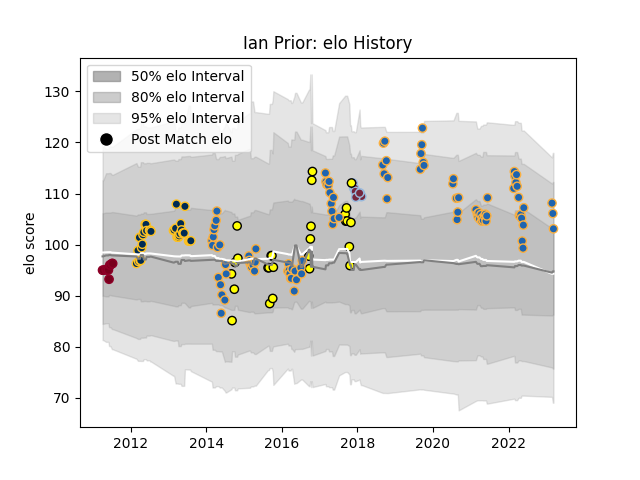

---  
layout: page  
title: Ian Prior  
date: 2023-03-16 19:55:09.627572  
categories: player  
---
# Ian Prior

## Positions: SH

## Current elo: 103.0

## Current Percentile: 83.0

# Elo History

# Match History

| Team            |   Appearances |   Win Rate |
|:----------------|--------------:|-----------:|
| Western Force   |           101 |   0.346535 |
| Brumbies        |            35 |   0.657143 |
| Perth Spirit    |            27 |   0.518519 |
| Queensland Reds |            10 |   0.9      |
| Harlequins      |             9 |   0.222222 |

| Opponent                 |   Matches |   Win Rate |
|:-------------------------|----------:|-----------:|
| Melbourne Rebels         |        16 |   0.625    |
| Queensland Reds          |        15 |   0.433333 |
| New South Wales Waratahs |        14 |   0.5      |
| Brumbies                 |        13 |   0        |
| Chiefs                   |         9 |   0.222222 |
| Blues                    |         9 |   0.333333 |
| Crusaders                |         8 |   0.25     |
| Queensland Country       |         7 |   0.857143 |
| Highlanders              |         7 |   0.428571 |
| Brisbane City            |         6 |   0.5      |
| Bulls                    |         6 |   0.5      |
| NSW Country Eagles       |         6 |   0.333333 |
| Hurricanes               |         6 |   0.5      |
| Melbourne Rising         |         5 |   1        |
| Stormers                 |         5 |   0.2      |
| Western Force            |         5 |   0.8      |
| Canberra Vikings         |         5 |   0.4      |
| Cheetahs                 |         5 |   0.6      |
| Lions                    |         4 |   0.75     |
| Fijian Drua              |         4 |   0.5      |
| Sharks                   |         4 |   0.25     |
| Greater Sydney Rams      |         3 |   0.666667 |
| Moana Pasifika           |         2 |   1        |
| North Harbour Rays       |         2 |   0.5      |
| Ulster                   |         2 |   0        |
| Sydney Stars             |         2 |   0.5      |
| Southern Kings           |         2 |   0.75     |
| Wasps                    |         1 |   0        |
| Sydney Rays              |         1 |   0        |
| Sunwolves                |         1 |   1        |
| Saracens                 |         1 |   1        |
| Scarlets                 |         1 |   1        |
| La Rochelle              |         1 |   0        |
| Exeter Chiefs            |         1 |   0        |
| Northampton Saints       |         1 |   0        |
| Jaguares                 |         1 |   1        |
| Bath Rugby               |         1 |   0        |