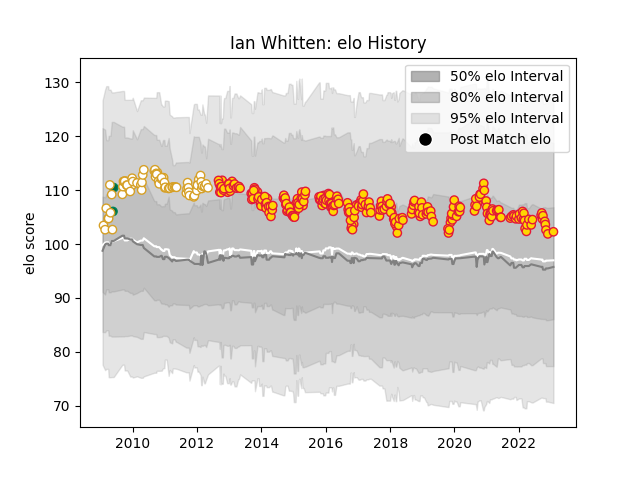

---  
layout: page  
title: Ian Whitten  
date: 2023-03-17 17:33:14.579103  
categories: player  
---
# Ian Whitten

## Positions: C, W

## Country: Ireland

## Current elo: 95.0

## Current Percentile: 45.0

# Elo History

# Match History

| Team          |   Appearances |   Win Rate |
|:--------------|--------------:|-----------:|
| Exeter Chiefs |           276 |   0.634058 |
| Ulster        |            75 |   0.56     |
| Ireland       |             2 |   1        |

| Opponent                 |   Matches |   Win Rate |
|:-------------------------|----------:|-----------:|
| Bath Rugby               |        25 |   0.66     |
| Gloucester Rugby         |        24 |   0.604167 |
| Northampton Saints       |        22 |   0.5      |
| Saracens                 |        21 |   0.452381 |
| Newcastle Falcons        |        20 |   0.8      |
| Wasps                    |        19 |   0.605263 |
| Leicester Tigers         |        19 |   0.526316 |
| Harlequins               |        19 |   0.684211 |
| Worcester Warriors       |        18 |   0.888889 |
| Sale Sharks              |        18 |   0.666667 |
| Glasgow Warriors         |        16 |   0.53125  |
| London Irish             |        12 |   0.833333 |
| Ospreys                  |        11 |   0.545455 |
| Munster                  |        10 |   0.35     |
| Leinster                 |         9 |   0.111111 |
| Bristol Rugby            |         9 |   0.777778 |
| Cardiff Blues            |         8 |   0.625    |
| Connacht                 |         8 |   0.8125   |
| Edinburgh                |         7 |   0.571429 |
| Clermont Auvergne        |         7 |   0.142857 |
| Dragons                  |         7 |   0.5      |
| Scarlets                 |         6 |   0.833333 |
| Aironi                   |         5 |   1        |
| Benetton Treviso         |         4 |   0.75     |
| La Rochelle              |         4 |   1        |
| Montpellier Herault      |         3 |   1        |
| London Welsh             |         3 |   0.666667 |
| Stade Francais Paris     |         3 |   0.333333 |
| Castres Olympique        |         2 |   0.5      |
| Biarritz Olympique       |         2 |   0.5      |
| Toulon                   |         2 |   0        |
| Ulster                   |         2 |   0.5      |
| Bayonne                  |         2 |   0.5      |
| Bordeaux Begles          |         2 |   1        |
| Canada                   |         1 |   1        |
| Racing 92                |         1 |   1        |
| Stade Toulousain         |         1 |   1        |
| United States of America |         1 |   1        |