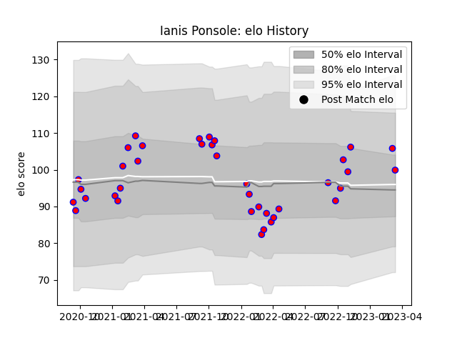

---  
layout: page  
title: Ianis Ponsole  
date: 2023-03-09 10:12:57.981408  
categories: player  
---
# Ianis Ponsole

## Positions: FL, N8

## Current elo: 106.0

## Current Percentile: 81.0

# Elo History

# Match History

| Team    |   Appearances |   Win Rate |
|:--------|--------------:|-----------:|
| Blagnac |            36 |   0.555556 |

| Opponent                   |   Matches |   Win Rate |
|:---------------------------|----------:|-----------:|
| Dax                        |         5 |   0.6      |
| Cognac Saint Jean d'Angély |         4 |   0.75     |
| Suresnes                   |         4 |   0.5      |
| Albi                       |         3 |   0.666667 |
| Chambery                   |         3 |   0.666667 |
| US Bressane                |         3 |   0        |
| Aubenas                    |         2 |   1        |
| Massy                      |         2 |   1        |
| Nice                       |         2 |   0.5      |
| Valence Romans Drome Rugby |         2 |   0.5      |
| Bourgoin-Jallieu           |         1 |   0        |
| Carqueiranne-Hyères        |         1 |   1        |
| Dijon                      |         1 |   0        |
| Narbonne                   |         1 |   0        |
| Rennes                     |         1 |   1        |
| Soyaux-Angouleme           |         1 |   0        |