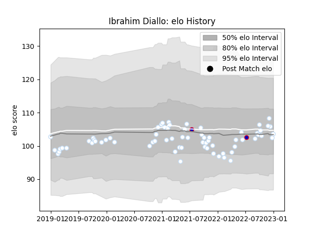

---  
layout: page  
title: Ibrahim Diallo  
date: 2023-01-06 00:22:56.040302  
categories: player  
---
# Ibrahim Diallo

## Positions: FL

## Country: France

## Current elo: 104.0

## Current Percentile: 46.0

# Elo History

# Match History

| Team      |   Appearances |   Win Rate |
|:----------|--------------:|-----------:|
| Racing 92 |            68 |   0.529412 |
| France    |             2 |   1        |

| Opponent             |   Matches |   Win Rate |
|:---------------------|----------:|-----------:|
| La Rochelle          |         8 |   0.375    |
| Castres Olympique    |         7 |   0.5      |
| Lyon                 |         6 |   0.5      |
| Stade Toulousain     |         6 |   0.166667 |
| Bordeaux Begles      |         6 |   0.166667 |
| Toulon               |         5 |   0.6      |
| Clermont Auvergne    |         5 |   0.8      |
| Pau                  |         5 |   1        |
| Stade Francais Paris |         4 |   0.5      |
| Brive                |         4 |   0.75     |
| Montpellier Herault  |         3 |   0.666667 |
| Agen                 |         3 |   0.833333 |
| Biarritz Olympique   |         2 |   0.5      |
| Leinster             |         1 |   0        |
| Australia            |         1 |   1        |
| Grenoble             |         1 |   1        |
| Perpignan            |         1 |   1        |
| Bayonne              |         1 |   0        |
| Japan                |         1 |   1        |