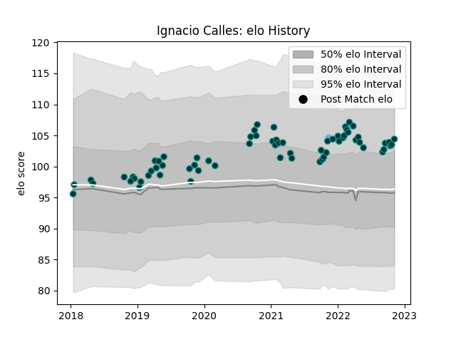

---  
layout: page  
title: Ignacio Calles  
date: 2022-12-09 13:19:22.920634  
categories: player  
---
# Ignacio Calles

## Positions: P

## Country: Argentina

## Current elo: 104.0

## Current Percentile: 78.0

# Elo History

# Match History

| Team      |   Appearances |   Win Rate |
|:----------|--------------:|-----------:|
| Pau       |            68 |   0.470588 |
| Argentina |             1 |   1        |

| Opponent             |   Matches |   Win Rate |
|:---------------------|----------:|-----------:|
| Stade Francais Paris |         7 |   0.285714 |
| Stade Toulousain     |         6 |   0.333333 |
| Lyon                 |         6 |   0.25     |
| Bordeaux Begles      |         5 |   0.6      |
| Brive                |         5 |   0.4      |
| Montpellier Herault  |         5 |   0.6      |
| Toulon               |         4 |   0.125    |
| Clermont Auvergne    |         4 |   0.25     |
| Racing 92            |         4 |   0.25     |
| Perpignan            |         3 |   1        |
| Bayonne              |         3 |   1        |
| Agen                 |         2 |   1        |
| Worcester Warriors   |         2 |   0.5      |
| Castres Olympique    |         2 |   0.5      |
| La Rochelle          |         2 |   0        |
| Ospreys              |         1 |   1        |
| Italy                |         1 |   1        |
| Grenoble             |         1 |   1        |
| Gloucester Rugby     |         1 |   1        |
| Edinburgh            |         1 |   0        |
| Cardiff Blues        |         1 |   0        |
| Calvisano            |         1 |   1        |
| Biarritz Olympique   |         1 |   1        |
| Zebre                |         1 |   1        |