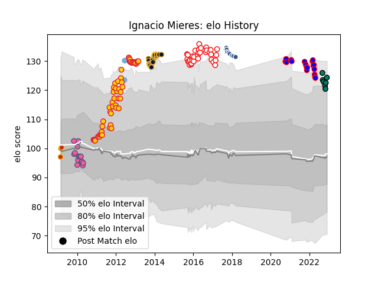

---  
layout: page  
title: Ignacio Mieres  
date: 2023-02-15 22:13:39.212929  
categories: player  
---
# Ignacio Mieres

## Positions: FH

## Country: Argentina

## Current elo: 119.0

## Current Percentile: 89.0

# Elo History

# Match History

| Team                 |   Appearances |   Win Rate |
|:---------------------|--------------:|-----------:|
| Exeter Chiefs        |            67 |   0.522388 |
| Dax                  |            34 |   0.382353 |
| Worcester Warriors   |            26 |   0.173077 |
| Dijon                |            18 |   0.166667 |
| Stade Francais Paris |            16 |   0.4375   |
| Agen                 |            10 |   0.1      |
| Suresnes             |             8 |   0.625    |
| Perpignan            |             3 |   0.666667 |
| Argentina            |             2 |   1        |

| Opponent                   |   Matches |   Win Rate |
|:---------------------------|----------:|-----------:|
| Sale Sharks                |         9 |   0.555556 |
| Bath Rugby                 |         8 |   0.1875   |
| Wasps                      |         8 |   0.625    |
| Northampton Saints         |         8 |   0.25     |
| Leicester Tigers           |         7 |   0.428571 |
| Perpignan                  |         7 |   0.571429 |
| London Irish               |         6 |   0.333333 |
| Saracens                   |         6 |   0.166667 |
| Albi                       |         6 |   0.333333 |
| Newcastle Falcons          |         5 |   0.6      |
| Biarritz Olympique         |         5 |   0.2      |
| Bourgoin-Jallieu           |         5 |   0.4      |
| Harlequins                 |         5 |   0.4      |
| Gloucester Rugby           |         5 |   0.4      |
| Clermont Auvergne          |         4 |   0.375    |
| Chambery                   |         3 |   0.333333 |
| Oyonnax                    |         3 |   0.5      |
| Worcester Warriors         |         3 |   1        |
| Bayonne                    |         3 |   0.333333 |
| Nice                       |         3 |   0.333333 |
| Carcassonne                |         3 |   0        |
| Mont-de-Marsan             |         3 |   0        |
| Tarbes                     |         3 |   0.333333 |
| Racing 92                  |         3 |   0.666667 |
| Stade Toulousain           |         3 |   0        |
| Dax                        |         3 |   0.333333 |
| Cognac Saint Jean d'Angély |         3 |   0        |
| Montauban                  |         3 |   0.5      |
| Suresnes                   |         2 |   0        |
| Toulon                     |         2 |   0.5      |
| Valence Romans Drome Rugby |         2 |   0        |
| Scarlets                   |         2 |   1        |
| Narbonne                   |         2 |   1        |
| Agen                       |         2 |   0        |
| Dragons                    |         2 |   1        |
| Exeter Chiefs              |         2 |   0        |
| Aurillac                   |         2 |   1        |
| Beziers                    |         2 |   0.5      |
| Cardiff Blues              |         2 |   0.75     |
| Castres Olympique          |         2 |   0        |
| Colomiers                  |         2 |   0.5      |
| Lyon                       |         2 |   0        |
| Yorkshire Carnegie         |         2 |   0.5      |
| La Rochelle                |         2 |   0        |
| London Welsh               |         2 |   0.5      |
| Leinster                   |         2 |   0        |
| Provence Rugby             |         1 |   1        |
| Montpellier Herault        |         1 |   1        |
| Bordeaux Begles            |         1 |   0        |
| US Bressane                |         1 |   0        |
| Brive                      |         1 |   0        |
| Carqueiranne-Hyères        |         1 |   1        |
| Pau                        |         1 |   0        |
| Stade Francais Paris       |         1 |   0        |
| Soyaux-Angouleme           |         1 |   1        |
| Cavalieri Prato            |         1 |   1        |
| Italy                      |         1 |   1        |
| France                     |         1 |   1        |
| Rennes                     |         1 |   1        |
| Edinburgh                  |         1 |   0        |
| Massy                      |         1 |   0        |