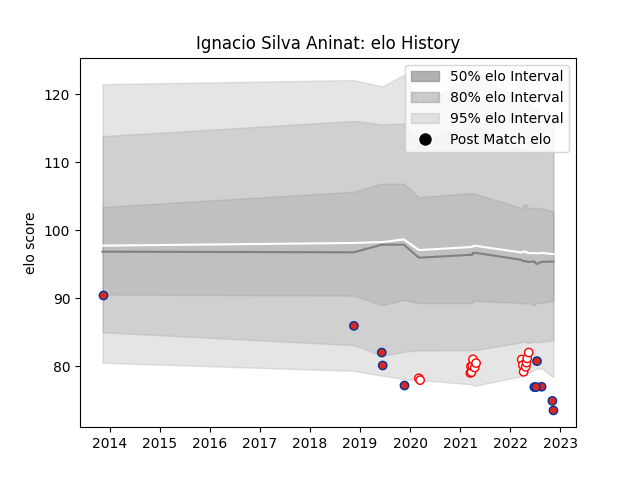

---  
layout: page  
title: Ignacio Silva Aninat  
date: 2022-11-16 11:27:19.963978  
categories: player  
---
# Ignacio Silva Aninat

## Positions: FL, N8

## Country: Chile

## Current elo: 74.0

## Current Percentile: 2.0

# Elo History

# Match History

| Team    |   Appearances |   Win Rate |
|:--------|--------------:|-----------:|
| Selknam |            16 |   0.6875   |
| Chile   |            11 |   0.181818 |

| Opponent                 |   Matches |   Win Rate |
|:-------------------------|----------:|-----------:|
| Penarol Rugby            |         5 |   0.6      |
| Jaguares XV              |         3 |   0.666667 |
| Olimpia Lions            |         3 |   0.666667 |
| Cafeteros Pro            |         2 |   1        |
| Cobras                   |         2 |   1        |
| Romania                  |         2 |   0        |
| Spain                    |         2 |   0        |
| United States of America |         2 |   0.5      |
| Brazil                   |         1 |   1        |
| Ceibos Rugby             |         1 |   0        |
| New Zealand Maori        |         1 |   0        |
| Portugal                 |         1 |   0        |
| Scotland                 |         1 |   0        |
| Tonga                    |         1 |   0        |