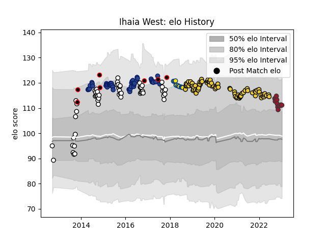

---  
layout: page  
title: Ihaia West  
date: 2022-11-15 23:45:07.763571  
categories: player  
---
# Ihaia West

## Positions: FH

## Country: New Zealand Maori

## Current elo: 107.0

## Current Percentile: 82.0

# Elo History

# Match History

| Team              |   Appearances |   Win Rate |
|:------------------|--------------:|-----------:|
| La Rochelle       |            82 |   0.609756 |
| Hawke's Bay       |            54 |   0.5      |
| Blues             |            47 |   0.43617  |
| Hurricanes        |            15 |   0.6      |
| Toulon            |             8 |   0.5      |
| New Zealand Maori |             6 |   0.833333 |

| Opponent                 |   Matches |   Win Rate |
|:-------------------------|----------:|-----------:|
| Racing 92                |        10 |   0.6      |
| Stade Toulousain         |        10 |   0.1      |
| Crusaders                |         9 |   0.111111 |
| Chiefs                   |         9 |   0.222222 |
| Toulon                   |         8 |   0.75     |
| Lyon                     |         6 |   0.666667 |
| Bay of Plenty            |         6 |   0.5      |
| Montpellier Herault      |         6 |   0.5      |
| Bordeaux Begles          |         6 |   0.666667 |
| Highlanders              |         6 |   0.333333 |
| Manawatu                 |         6 |   0.5      |
| Northland                |         5 |   0.6      |
| Hurricanes               |         5 |   0.2      |
| Pau                      |         5 |   1        |
| Counties Manukau         |         5 |   0.4      |
| Castres Olympique        |         5 |   0.4      |
| Southland                |         5 |   0.9      |
| Wellington               |         5 |   0.7      |
| Clermont Auvergne        |         4 |   0.5      |
| Stade Francais Paris     |         4 |   0.5      |
| Brive                    |         4 |   1        |
| Otago                    |         4 |   1        |
| Tasman                   |         4 |   0        |
| North Harbour            |         4 |   0.5      |
| Western Force            |         4 |   1        |
| Melbourne Rebels         |         4 |   0.75     |
| Sharks                   |         3 |   0.666667 |
| Perpignan                |         3 |   0.666667 |
| Taranaki                 |         3 |   0.333333 |
| Agen                     |         3 |   1        |
| Brumbies                 |         3 |   0.666667 |
| Bulls                    |         3 |   0.666667 |
| Lions                    |         3 |   0.333333 |
| Canterbury               |         3 |   0        |
| Auckland                 |         2 |   0.5      |
| Sale Sharks              |         2 |   1        |
| Bayonne                  |         2 |   0.5      |
| Waikato                  |         2 |   0        |
| United States of America |         2 |   1        |
| Blues                    |         2 |   1        |
| Bristol Rugby            |         2 |   0.5      |
| British and Irish Lions  |         2 |   0.5      |
| Zebre                    |         2 |   1        |
| Cheetahs                 |         2 |   0.5      |
| RC Enisei                |         2 |   1        |
| Queensland Reds          |         2 |   0.75     |
| Exeter Chiefs            |         2 |   0        |
| Japan                    |         2 |   1        |
| New South Wales Waratahs |         2 |   1        |
| Canada                   |         1 |   1        |
| Stormers                 |         1 |   0        |
| Sunwolves                |         1 |   0        |
| Glasgow Warriors         |         1 |   1        |
| Grenoble                 |         1 |   1        |
| Jaguares                 |         1 |   1        |
| Biarritz Olympique       |         1 |   0        |
| La Rochelle              |         1 |   0        |
| Southern Kings           |         1 |   1        |