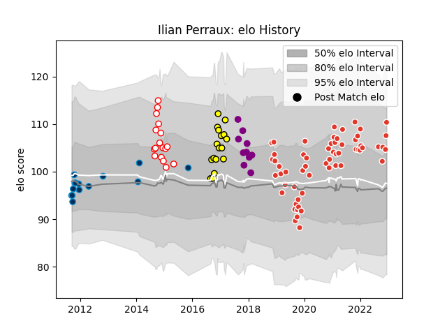

---  
layout: page  
title: Ilian Perraux  
date: 2023-01-06 11:43:09.265242  
categories: player  
---
# Ilian Perraux

## Positions: FH, C

## Current elo: 107.0

## Current Percentile: 75.0

# Elo History

# Match History

| Team                |   Appearances |   Win Rate |
|:--------------------|--------------:|-----------:|
| Biarritz Olympique  |            70 |   0.571429 |
| Albi                |            20 |   0.45     |
| Dax                 |            19 |   0.315789 |
| Soyaux-Angouleme    |            18 |   0.472222 |
| Montpellier Herault |            14 |   0.357143 |

| Opponent                   |   Matches |   Win Rate |
|:---------------------------|----------:|-----------:|
| Carcassonne                |        10 |   0.35     |
| Vannes                     |         9 |   0.333333 |
| Soyaux-Angouleme           |         8 |   0.625    |
| Montauban                  |         8 |   0.625    |
| Beziers                    |         8 |   0.5      |
| Colomiers                  |         7 |   0.571429 |
| Mont-de-Marsan             |         7 |   0.5      |
| Aurillac                   |         6 |   0.666667 |
| Perpignan                  |         6 |   0.25     |
| Nevers                     |         5 |   0.2      |
| Narbonne                   |         5 |   0.7      |
| Biarritz Olympique         |         5 |   0.4      |
| Provence Rugby             |         5 |   0.9      |
| Grenoble                   |         5 |   0.6      |
| Toulon                     |         4 |   0.25     |
| Dax                        |         4 |   0.75     |
| Oyonnax                    |         4 |   0.75     |
| Pau                        |         3 |   0        |
| Agen                       |         3 |   0        |
| Bayonne                    |         2 |   0.5      |
| Clermont Auvergne          |         2 |   0        |
| Valence Romans Drome Rugby |         2 |   0.5      |
| Brive                      |         2 |   0.5      |
| Tarbes                     |         2 |   0.5      |
| Stade Francais Paris       |         2 |   0.75     |
| Rouen                      |         2 |   1        |
| Bordeaux Begles            |         2 |   0        |
| Glasgow Warriors           |         2 |   0.25     |
| Massy                      |         2 |   0.5      |
| Bourgoin-Jallieu           |         2 |   0.5      |
| Benetton Treviso           |         1 |   1        |
| Montpellier Herault        |         1 |   0        |
| Castres Olympique          |         1 |   0        |
| Stade Toulousain           |         1 |   1        |
| US Bressane                |         1 |   1        |
| Albi                       |         1 |   0        |
| Roval Drome XV             |         1 |   1        |