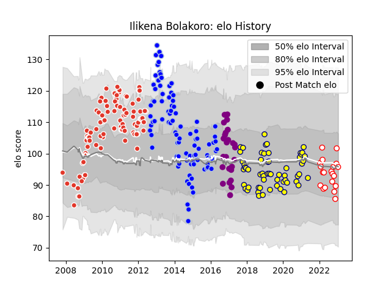

---  
layout: page  
title: Ilikena Bolakoro  
date: 2022-12-18 16:33:50.299968  
categories: player  
---
# Ilikena Bolakoro

## Positions: W, C

## Current elo: 101.0

## Current Percentile: 62.0

# Elo History

# Match History

| Team               |   Appearances |   Win Rate |
|:-------------------|--------------:|-----------:|
| Biarritz Olympique |            96 |   0.546875 |
| Colomiers          |            85 |   0.505882 |
| Nevers             |            45 |   0.633333 |
| Soyaux-Angouleme   |            23 |   0.543478 |
| Dax                |            19 |   0.631579 |

| Opponent                   |   Matches |   Win Rate |
|:---------------------------|----------:|-----------:|
| Perpignan                  |        13 |   0.384615 |
| Albi                       |        10 |   0.3      |
| Bayonne                    |        10 |   0.55     |
| Beziers                    |        10 |   0.45     |
| Narbonne                   |        10 |   0.7      |
| Bourgoin-Jallieu           |         9 |   0.555556 |
| Brive                      |         9 |   0.444444 |
| Tarbes                     |         9 |   0.444444 |
| Aurillac                   |         9 |   0.555556 |
| Stade Toulousain           |         9 |   0.333333 |
| Dax                        |         9 |   0.777778 |
| Carcassonne                |         8 |   0.75     |
| Mont-de-Marsan             |         8 |   0.75     |
| Biarritz Olympique         |         8 |   0.625    |
| Provence Rugby             |         8 |   0.75     |
| Montauban                  |         7 |   0.571429 |
| Clermont Auvergne          |         7 |   0.428571 |
| Castres Olympique          |         7 |   0.214286 |
| Massy                      |         6 |   0.5      |
| Lyon                       |         6 |   0.333333 |
| Montpellier Herault        |         6 |   0.333333 |
| Oyonnax                    |         6 |   0.333333 |
| La Rochelle                |         6 |   0.333333 |
| Soyaux-Angouleme           |         5 |   0.7      |
| Agen                       |         5 |   0.4      |
| Vannes                     |         5 |   0.7      |
| Racing 92                  |         4 |   0.5      |
| Colomiers                  |         4 |   1        |
| US Bressane                |         4 |   0.75     |
| Toulon                     |         4 |   0.75     |
| Auch                       |         4 |   0.75     |
| Stade Francais Paris       |         4 |   0.75     |
| Grenoble                   |         3 |   0.666667 |
| Ospreys                    |         3 |   0.666667 |
| Pau                        |         3 |   0.666667 |
| Aironi                     |         2 |   0.5      |
| Valence Romans Drome Rugby |         2 |   0.5      |
| Ulster                     |         2 |   0.5      |
| Bath Rugby                 |         2 |   1        |
| Benetton Treviso           |         2 |   0.5      |
| Saracens                   |         2 |   0.5      |
| Bordeaux Begles            |         2 |   1        |
| Blagnac                    |         2 |   1        |
| Gloucester Rugby           |         2 |   0.5      |
| Cardiff Blues              |         2 |   0        |
| Cognac Saint Jean d'Angély |         2 |   0.5      |
| Dragons                    |         2 |   1        |
| Calvisano                  |         1 |   1        |
| Suresnes                   |         1 |   1        |
| Carqueiranne-Hyères        |         1 |   1        |
| Chambery                   |         1 |   1        |
| Dijon                      |         1 |   0        |
| Glasgow Warriors           |         1 |   1        |