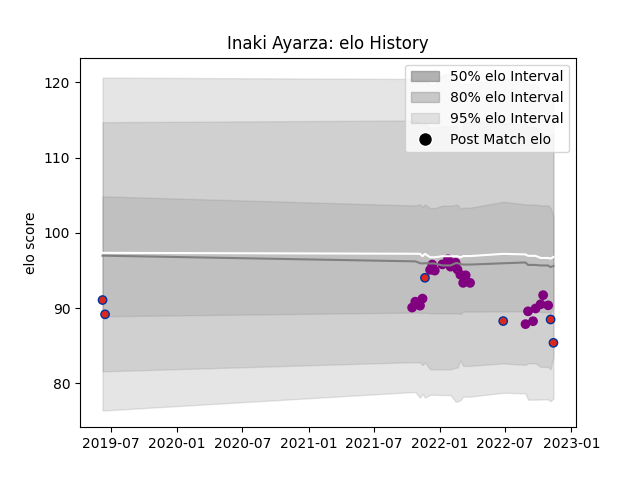

---  
layout: page  
title: Inaki Ayarza  
date: 2022-11-16 11:37:45.556769  
categories: player  
---
# Inaki Ayarza

## Positions: C, W

## Country: Chile

## Current elo: 85.0

## Current Percentile: 22.0

# Elo History

# Match History

| Team             |   Appearances |   Win Rate |
|:-----------------|--------------:|-----------:|
| Soyaux-Angouleme |            23 |   0.608696 |
| Chile            |             6 |   0.166667 |

| Opponent                   |   Matches |   Win Rate |
|:---------------------------|----------:|-----------:|
| Valence Romans Drome Rugby |         2 |        0.5 |
| Chambery                   |         2 |        0   |
| Suresnes                   |         2 |        1   |
| Dax                        |         2 |        0.5 |
| Romania                    |         2 |        0   |
| Albi                       |         1 |        1   |
| Nice                       |         1 |        0   |
| Tonga                      |         1 |        0   |
| Tarbes                     |         1 |        1   |
| Spain                      |         1 |        0   |
| Scotland                   |         1 |        0   |
| Russia                     |         1 |        1   |
| Provence Rugby             |         1 |        0   |
| Nevers                     |         1 |        0   |
| Aubenas                    |         1 |        1   |
| Mont-de-Marsan             |         1 |        0   |
| Massy                      |         1 |        1   |
| Dijon                      |         1 |        1   |
| Colomiers                  |         1 |        0   |
| Cognac Saint Jean d'Angély |         1 |        1   |
| Carcassonne                |         1 |        1   |
| Bourgoin-Jallieu           |         1 |        1   |
| Beziers                    |         1 |        1   |
| Vannes                     |         1 |        1   |