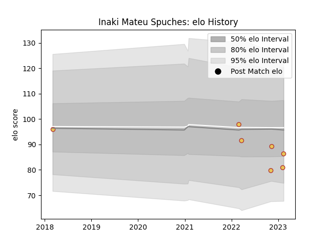

---  
layout: page  
title: Inaki Mateu Spuches  
date: 2023-02-05 17:59:26.975078  
categories: player  
---
# Inaki Mateu Spuches

## Positions: C, W

## Country: Spain

## Current elo: 83.0

## Current Percentile: 33.0

# Elo History

# Match History

| Team               |   Appearances |   Win Rate |
|:-------------------|--------------:|-----------:|
| Spain              |             6 |   0.5      |
| Rugby Viadana 1970 |             3 |   0.333333 |

| Opponent               |   Matches |   Win Rate |
|:-----------------------|----------:|-----------:|
| Conad Valorugby Emilia |         2 |        0.5 |
| Georgia                |         2 |        0   |
| Femi CZ Rugby Rovigo   |         1 |        0   |
| Namibia                |         1 |        1   |
| Netherlands            |         1 |        1   |
| Romania                |         1 |        1   |
| Tonga                  |         1 |        0   |