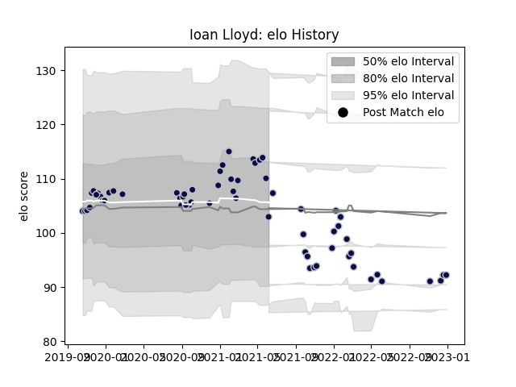

---  
layout: page  
title: Ioan Lloyd  
date: 2022-12-14 11:29:10.262720  
categories: player  
---
# Ioan Lloyd

## Positions: W, FB

## Current elo: 93.0

## Current Percentile: 40.0

# Elo History

# Match History

| Team          |   Appearances |   Win Rate |
|:--------------|--------------:|-----------:|
| Bristol Rugby |            59 |   0.610169 |

| Opponent             |   Matches |   Win Rate |
|:---------------------|----------:|-----------:|
| Exeter Chiefs        |         6 |   0.5      |
| Sale Sharks          |         6 |   0.333333 |
| Bath Rugby           |         5 |   0.8      |
| London Irish         |         5 |   0.6      |
| Worcester Warriors   |         5 |   0.8      |
| Harlequins           |         4 |   0.25     |
| Leicester Tigers     |         4 |   0.5      |
| Wasps                |         4 |   0.25     |
| Saracens             |         4 |   0.25     |
| Stade Francais Paris |         3 |   1        |
| Gloucester Rugby     |         3 |   1        |
| Newcastle Falcons    |         3 |   0.666667 |
| Brive                |         2 |   1        |
| Northampton Saints   |         1 |   1        |
| Scarlets             |         1 |   1        |
| Perpignan            |         1 |   1        |
| Bordeaux Begles      |         1 |   1        |
| Zebre                |         1 |   1        |