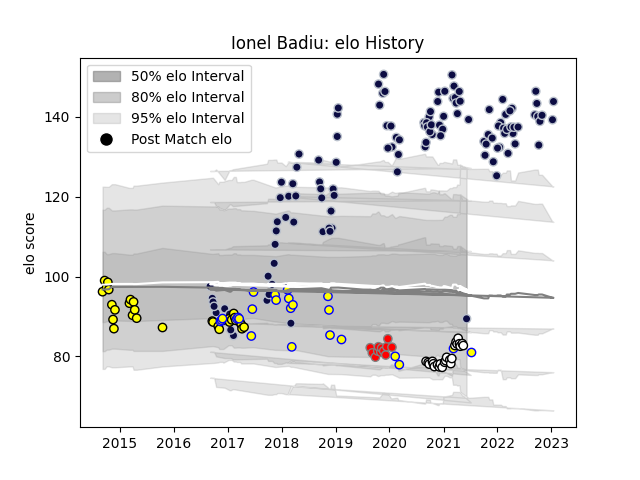

---  
layout: page  
title: Ionel Badiu  
date: 2023-03-02 11:20:37.904343  
categories: player  
---
# Ionel Badiu

## Positions: L, P

## Country: Romania

## Current elo: 89.0

## Current Percentile: 17.0

# Elo History

# Match History

| Team                       |   Appearances |   Win Rate |
|:---------------------------|--------------:|-----------:|
| Bristol Rugby              |           120 |   0.591667 |
| Carcassonne                |            31 |   0.354839 |
| Romania                    |            24 |   0.541667 |
| Valence Romans Drome Rugby |            24 |   0.416667 |
| Roval Drome XV             |            12 |   0.25     |

| Opponent                 |   Matches |   Win Rate |
|:-------------------------|----------:|-----------:|
| Exeter Chiefs            |        10 |   0.2      |
| Harlequins               |         9 |   0.444444 |
| Northampton Saints       |         8 |   0.5      |
| Wasps                    |         8 |   0.375    |
| Mont-de-Marsan           |         7 |   0.357143 |
| Worcester Warriors       |         7 |   0.714286 |
| Bath Rugby               |         7 |   0.714286 |
| Leicester Tigers         |         6 |   0.666667 |
| Perpignan                |         6 |   0.333333 |
| London Irish             |         6 |   0.583333 |
| Sale Sharks              |         5 |   0.4      |
| Beziers                  |         5 |   0.3      |
| Gloucester Rugby         |         5 |   0.4      |
| Oyonnax                  |         5 |   0.2      |
| Newcastle Falcons        |         5 |   0.6      |
| Bourgoin-Jallieu         |         4 |   0.75     |
| Saracens                 |         4 |   0        |
| Aurillac                 |         4 |   0.5      |
| Montauban                |         4 |   0.25     |
| Russia                   |         4 |   0.5      |
| Rouen                    |         3 |   0.333333 |
| Provence Rugby           |         3 |   0        |
| Vannes                   |         3 |   0.333333 |
| Georgia                  |         3 |   0.333333 |
| Agen                     |         3 |   0        |
| Zebre                    |         3 |   0.833333 |
| Carcassonne              |         3 |   0.666667 |
| Colomiers                |         3 |   0.333333 |
| Biarritz Olympique       |         3 |   0.333333 |
| Rotherham Titans         |         2 |   1        |
| Canada                   |         2 |   1        |
| Ealing Trailfinders      |         2 |   1        |
| Brive                    |         2 |   1        |
| RC Enisei                |         2 |   1        |
| Bordeaux Begles          |         2 |   0.5      |
| Cardiff Blues            |         2 |   0        |
| Belgium                  |         2 |   1        |
| Stade Francais Paris     |         2 |   1        |
| United States of America |         2 |   0.5      |
| Uruguay                  |         2 |   0.5      |
| Bedford                  |         2 |   1        |
| Yorkshire Carnegie       |         2 |   1        |
| Nottingham               |         2 |   1        |
| Portugal                 |         2 |   0.5      |
| Massy                    |         2 |   0.5      |
| London Scottish          |         2 |   1        |
| Grenoble                 |         2 |   0        |
| Doncaster                |         2 |   1        |
| La Rochelle              |         2 |   0.5      |
| Jersey                   |         2 |   0.5      |
| Clermont Auvergne        |         1 |   0        |
| Spain                    |         1 |   0        |
| Germany                  |         1 |   1        |
| Argentina                |         1 |   0        |
| Bayonne                  |         1 |   0        |
| Dragons                  |         1 |   1        |
| Toulon                   |         1 |   1        |
| Tonga                    |         1 |   0        |
| Tarbes                   |         1 |   1        |
| Hartpury College         |         1 |   1        |
| Japan                    |         1 |   0        |
| Soyaux-Angouleme         |         1 |   1        |
| Scarlets                 |         1 |   1        |
| Nevers                   |         1 |   1        |
| Samoa                    |         1 |   1        |
| Brazil                   |         1 |   1        |
| Dax                      |         1 |   0        |
| Richmond                 |         1 |   1        |
| Albi                     |         1 |   0        |
| Cornish Pirates          |         1 |   1        |
| Pau                      |         1 |   1        |
| Narbonne                 |         1 |   1        |
| Enisey-STM Krasnoyarsk   |         1 |   1        |