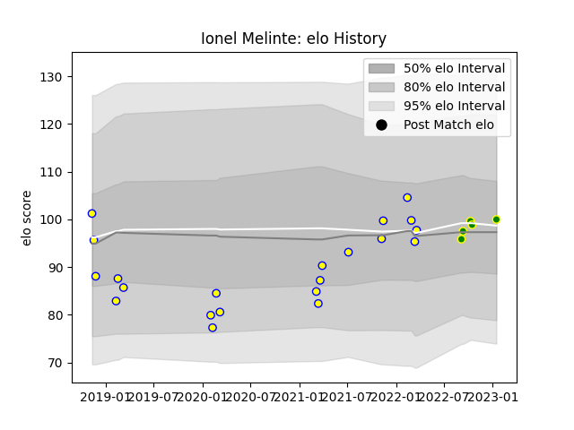

---  
layout: page  
title: Ionel Melinte  
date: 2023-02-02 19:14:39.494163  
categories: player  
---
# Ionel Melinte

## Positions: FB, FH

## Country: Romania

## Current elo: 98.0

## Current Percentile: 55.0

# Elo History

# Match History

| Team                |   Appearances |   Win Rate |
|:--------------------|--------------:|-----------:|
| Romania             |            21 |   0.47619  |
| Carqueiranne-Hyères |             7 |   0.285714 |

| Opponent                   |   Matches |   Win Rate |
|:---------------------------|----------:|-----------:|
| Georgia                    |         4 |   0        |
| Portugal                   |         4 |   0.75     |
| Russia                     |         3 |   0.333333 |
| Spain                      |         3 |   0.666667 |
| Netherlands                |         2 |   1        |
| Suresnes                   |         2 |   0.5      |
| Uruguay                    |         2 |   0.5      |
| Albi                       |         1 |   0        |
| Argentina                  |         1 |   0        |
| Bourgoin-Jallieu           |         1 |   0        |
| Germany                    |         1 |   1        |
| Tarbes                     |         1 |   1        |
| US Bressane                |         1 |   0        |
| United States of America   |         1 |   0        |
| Valence Romans Drome Rugby |         1 |   0        |