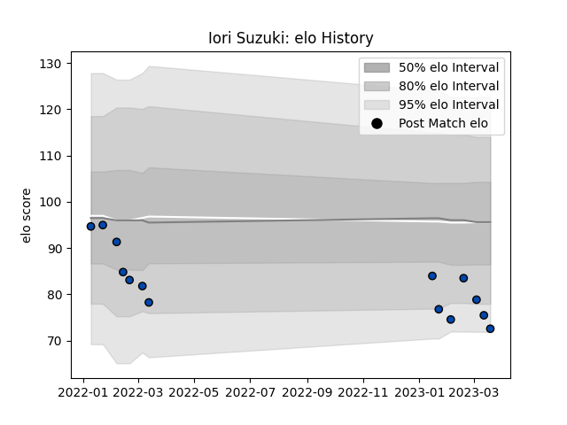

---  
layout: page  
title: Iori Suzuki  
date: 2023-01-17 11:30:21.871616  
categories: player  
---
# Iori Suzuki

## Positions: N8, FL

## Current elo: 80.0

## Current Percentile: 5.0

# Elo History

# Match History

| Team                |   Appearances |   Win Rate |
|:--------------------|--------------:|-----------:|
| Skyactivs Hiroshima |             9 |          0 |

| Opponent                        |   Matches |   Win Rate |
|:--------------------------------|----------:|-----------:|
| Hanazono Kintetsu Liners        |         2 |          0 |
| Mie Honda Heat                  |         2 |          0 |
| Chugoku Red Regulions           |         1 |          0 |
| Hino Red Dolphins               |         1 |          0 |
| Kamaishi Seawaves               |         1 |          0 |
| Mitsubishi Dynaboars            |         1 |          0 |
| NTT Docomo Red Hurricanes Osaka |         1 |          0 |