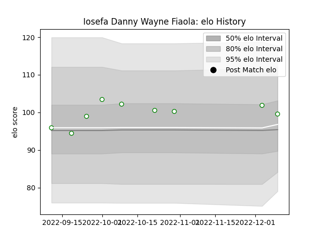

---  
layout: page  
title: Iosefa Danny Wayne Fiaola  
date: 2023-02-02 18:58:53.148092  
categories: player  
---
# Iosefa Danny Wayne Fiaola

## Positions: L

## Current elo: 104.0

## Current Percentile: 79.0

# Elo History

# Match History

| Team       |   Appearances |   Win Rate |
|:-----------|--------------:|-----------:|
| Nottingham |            13 |   0.307692 |

| Opponent            |   Matches |   Win Rate |
|:--------------------|----------:|-----------:|
| Caldy               |         2 |        0.5 |
| Cornish Pirates     |         2 |        0   |
| Doncaster           |         2 |        0.5 |
| Bedford             |         1 |        0   |
| Coventry            |         1 |        0   |
| Ealing Trailfinders |         1 |        0   |
| Hartpury College    |         1 |        0   |
| Jersey              |         1 |        0   |
| London Scottish     |         1 |        1   |
| Richmond            |         1 |        1   |